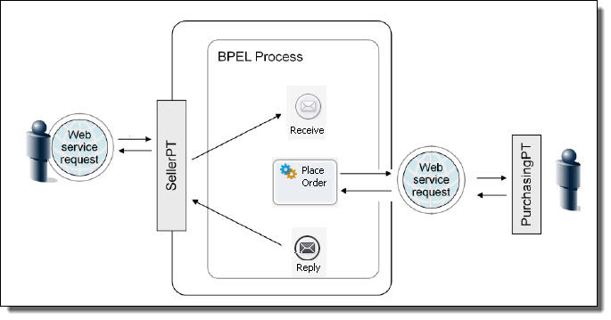

Arquitectura Orientada a Servicios Unidad 4. 
# Impacto, Evolución y Relevancia Actual de BPEL

## 1. Introducción y Contexto Histórico
- Definición de BPEL

Business Process Execution Language (BPEL) es un lenguaje de programación basado en XML diseñado para definir procesos de negocio que interactúan a través de servicios web. Su propósito principal es la orquestación de servicios: permite coordinar múltiples servicios individuales en un flujo de trabajo empresarial complejo.

BPEL está estrechamente ligado a la Arquitectura Orientada a Servicios (SOA), ya que proporciona una manera estándar de definir procesos de negocio que integran diferentes servicios en una sola lógica de negocio.

BPEL (Business Process Execution Language) es un lenguaje basado en XML que permite que los servicios web , las API y los procesos humanos en una arquitectura orientada a servicios ( SOA ) se interconecten y compartan datos en un flujo de trabajo empresarial.

### Evolución Histórica de BPEL

**BPEL (Business Process Execution Language)** fue creado a principios del siglo XXI con el objetivo de mejorar la orquestación de procesos de negocio, facilitando la integración y automatización de servicios web. Este lenguaje fue concebido para combinar y estandarizar dos lenguajes preexistentes pero obsoletos en ese momento: **WSFL (Web Services Flow Language)** de **IBM** y **Xlang** de **Microsoft**. Ambos lenguajes fueron desarrollados para modelar y ejecutar procesos de negocio complejos a través de servicios web, pero presentaban limitaciones que BPEL intentó resolver.

- **2001**: **IBM** y **Microsoft** desarrollan BPEL como una solución para unificar WSFL y Xlang, promoviendo la interoperabilidad entre plataformas de software mediante el uso de servicios web. Esta visión surgió en un contexto donde las empresas buscaban automatizar procesos de negocio a gran escala utilizando las tecnologías emergentes de la web.
  
- **2002**: **IBM** y **Microsoft** publican la especificación inicial de BPEL bajo el nombre de **BPEL4WS** (Business Process Execution Language for Web Services). Esta primera versión del estándar se centraba en la capacidad de orquestar servicios web y coordinar las interacciones entre aplicaciones distribuidas, permitiendo que las empresas pudieran definir procesos de negocio de manera más estructurada y eficiente.

- **2003**: BPEL es entregado a **OASIS** (Organization for the Advancement of Structured Information Standards) para su estandarización. OASIS asume el liderazgo en la creación de una especificación abierta, buscando la adopción universal del lenguaje en la industria. A partir de esta fecha, el lenguaje empieza a ganar popularidad en el ámbito empresarial como la solución estándar para la orquestación de servicios web.

- **2007**: **WS-BPEL 2.0**, la versión más madura y ampliamente adoptada de BPEL, es publicada. Esta versión introdujo mejoras significativas en la gestión de flujos de trabajo y en la ejecución de procesos complejos, abordando algunas de las limitaciones de versiones anteriores. La adopción de BPEL 2.0 en plataformas de integración empresarial consolidó al lenguaje como un estándar de facto en la automatización de procesos de negocio.

- **Años 2010 en adelante**: BPEL comienza a declinar frente a tecnologías más ágiles y flexibles. **BPMN (Business Process Model and Notation)**, que se centra en la facilidad de uso y en el modelado visual de procesos, y las **arquitecturas basadas en microservicios** que favorecen una mayor modularidad y escalabilidad, han sido factores clave que impulsaron la obsolescencia de BPEL en la mayoría de las organizaciones. Las soluciones de automatización de procesos de negocio basadas en **Low-Code** y **No-Code** también han reducido la necesidad de un enfoque tan rígido como el que BPEL requería.

---

### Impacto Inicial de BPEL

Durante la década de 2000, **BPEL** fue una herramienta revolucionaria que permitió a las empresas automatizar y coordinar procesos de negocio de manera eficiente y escalable. La capacidad de orquestar servicios web y coordinar interacciones entre aplicaciones distribuidas a través de estándares abiertos fue fundamental para muchas grandes organizaciones que adoptaron BPEL como motor de integración.

**Plataformas y Herramientas que Implementaron BPEL**:

1. **Oracle BPEL Process Manager**:
   - Fue una de las principales plataformas comerciales que implementaron BPEL. Oracle BPEL Process Manager permitió a las empresas automatizar flujos de trabajo complejos, integrando múltiples servicios web y proporcionando soporte para transacciones distribuidas, lo que lo convirtió en una opción popular para empresas que necesitaban orquestar servicios en un entorno SOA (Arquitectura Orientada a Servicios).

2. **IBM WebSphere Process Server**:
   - Esta plataforma de **IBM** fue una de las más influyentes en la adopción de BPEL. Proporcionó un marco robusto para la gestión de procesos de negocio, la integración de aplicaciones y la orquestación de servicios web. WebSphere fue adoptado por muchas empresas en sectores como banca y telecomunicaciones, donde la fiabilidad y la escalabilidad eran cruciales.

3. **Apache ODE (Orchestration Director Engine)**:
   - **Apache ODE** fue una implementación de código abierto de BPEL que permitió a las organizaciones pequeñas y medianas aprovechar las capacidades de orquestación sin incurrir en los costos de soluciones comerciales. ODE proporcionó un motor para la ejecución de procesos de negocio definidos en BPEL, y su naturaleza de código abierto fomentó la adopción en la comunidad de software libre.

Durante este período, BPEL fue clave para empresas que necesitaban coordinar aplicaciones distribuidas y automatizar flujos de trabajo entre sistemas heterogéneos, favoreciendo la integración entre diversas plataformas y proporcionando un marco común para la gestión de procesos de negocio a gran escala.

**Adopción en Industrias**:
- El **sector financiero** y las **telecomunicaciones** fueron dos de los sectores más beneficiados por la adopción de BPEL debido a sus necesidades de integración de servicios y gestión de procesos de negocio complejos. BPEL permitió una mayor flexibilidad en la integración de sistemas y en la automatización de procesos entre diferentes aplicaciones y plataformas.

---

BPEL jugó un papel crucial en la evolución de la **orquestación de servicios web** y en la creación de flujos de trabajo empresariales más eficientes. Sin embargo, como se mencionó anteriormente, su adopción ha disminuido con el tiempo debido a las nuevas tecnologías y arquitecturas que ofrecen una mayor flexibilidad y facilidad de uso.

## 2. Análisis Técnico de BPEL

#### Características Principales 

**BPEL (Business Process Execution Language)** es un lenguaje declarativo basado en XML que permite especificar la orquestación de servicios web mediante un conjunto de actividades que definen el flujo de trabajo. Las características más destacadas de BPEL son:

#### 1. **Definición del Flujo de Trabajo**:
   Un **proceso BPEL** especifica el **orden exacto** en que se deben invocar los servicios web participantes, pudiendo hacerlo de manera **secuencial** o **paralela**. Esta flexibilidad permite crear flujos de trabajo complejos en los que las actividades se coordinan para ejecutar tareas específicas en el orden requerido por el negocio.

   **Ejemplo**: Un proceso puede invocar un servicio de verificación de crédito y, si el crédito es aprobado, proceder con la creación de un pedido de compra, todo de manera automatizada y coordinada.

#### 2. **Condicionales y Bucles**:
   BPEL permite expresar **comportamientos condicionales**. Por ejemplo, la invocación de un servicio web puede depender de la respuesta de un servicio anterior, o se puede tomar una decisión basada en el valor de una variable. Además, permite **construir bucles** y definir **variables**, lo que da lugar a procesos más dinámicos y adaptables.

   **Ejemplo**: Un bucle puede ser usado para procesar una lista de elementos de forma iterativa, invocando un servicio para cada elemento.

#### 3. **Manejo de Excepciones y Fallos**:
   BPEL soporta la definición de **gestores de fallos** y **manejo de excepciones** mediante actividades como `<throw>`, que permite lanzar errores cuando algo sale mal en un proceso. Esto es esencial para garantizar la fiabilidad en los procesos de negocio, ya que permite gestionar errores de manera explícita.

   **Ejemplo**: Si una invocación a un servicio falla, BPEL puede lanzar una excepción, lo que permite que el sistema tome medidas correctivas o notifique a los usuarios del error.

#### 4. **Actividades Primitivas**:
   BPEL se compone de una serie de **actividades primitivas**, que son las unidades más básicas y fundamentales del lenguaje. Algunas de las principales son:

   - **`<invoke>`**: Llama a otro servicio web.
   - **`<receive>`**: Espera la llegada de un mensaje o solicitud.
   - **`<reply>`**: Envía una respuesta a un servicio.
   - **`<assign>`**: Asigna valores a variables o campos.
   - **`<throw>`**: Lanza una excepción o error.
   - **`<wait>`**: Introduce una espera o pausa en el flujo.
   - **`<terminate>`**: Finaliza un proceso de manera abrupta.

   Estas actividades primitivas permiten construir flujos de trabajo de cualquier complejidad.

   **Ejemplo**: Un proceso BPEL podría esperar una respuesta de un cliente utilizando `<receive>`, luego procesar los datos con `<assign>` y finalmente invocar un servicio externo con `<invoke>`.

#### 5. **Actividades de Estructura**:
   Para combinar las actividades primitivas y definir flujos de trabajo más complejos, BPEL introduce **actividades de estructura**. Estas son:

   - **`<sequence>`**: Permite definir un conjunto de actividades que se ejecutarán de manera secuencial, una tras otra.
   - **`<flow>`**: Permite definir un conjunto de actividades que se ejecutarán en paralelo, sin un orden específico.
   - **`<switch>`**: Implementa un bloque condicional, donde se pueden evaluar diferentes condiciones y ejecutar el camino correspondiente.
   - **`<while>`**: Define un bucle, donde un conjunto de actividades se repiten mientras se cumpla una condición.
   - **`<pick>`**: Permite la selección de uno de varios caminos alternativos, esperando que se cumpla una condición específica.

   **Ejemplo**: Un flujo de trabajo podría ejecutar varias tareas en paralelo usando `<flow>`, o podría seleccionar entre diferentes opciones dependiendo de condiciones específicas utilizando `<switch>`.

#### 6. **Elementos Clave en BPEL**:
   BPEL permite estructurar y gestionar un proceso de negocio mediante los siguientes **elementos clave**:

   - **Procesos**: Son la unidad principal de orquestación en BPEL, representando un conjunto de actividades que definen un flujo de trabajo completo.
   - **Actividades**: Son las tareas individuales que se ejecutan dentro de un proceso (como invocar servicios, recibir datos, esperar eventos, etc.).
   - **Variables**: Son los datos que fluyen entre actividades, permitiendo almacenar valores intermedios o resultados de operaciones.
   - **Socios (Partners)**: Representan los servicios web externos que interactúan con el proceso BPEL.

   **Ejemplo**: Un proceso BPEL podría involucrar actividades como invocar un servicio de verificación de pago (actividad `<invoke>`), esperar una respuesta del cliente (actividad `<receive>`), y luego almacenar el resultado en una variable para usarlo en una actividad posterior (actividad `<assign>`).

#### 7. **Orquestación Completa de Flujos de Trabajo**:
   BPEL permite **definir flujos de trabajo complejos**, incluyendo la ejecución de actividades en paralelo, el manejo de decisiones condicionales y excepciones, y la coordinación de transacciones a través de servicios distribuidos. 

   **Ejemplo**: Un proceso BPEL que gestiona una transacción de compra en línea podría coordinar la validación de pago, la creación de un pedido, y el envío de una notificación al cliente, todo dentro de un solo proceso, sin intervención manual.

---

En resumen, **BPEL** proporciona una forma estructurada y flexible de orquestar servicios web y gestionar procesos de negocio complejos, permitiendo una alta capacidad de personalización y control. Sin embargo, su rigidez y complejidad en entornos ágiles han hecho que tecnologías más modernas, como **BPMN** y arquitecturas basadas en **microservicios**, hayan ganado popularidad como alternativas más dinámicas y fáciles de usar.

### Fortalezas y Debilidades de BPEL

#### Fortalezas de BPEL:

1. **Integración en Arquitecturas SOA (Arquitectura Orientada a Servicios)**:
   BPEL juega un papel crucial en la integración de aplicaciones empresariales mediante la orquestación de servicios web. En una **SOA**, los servicios son unidades independientes que interactúan a través de APIs. BPEL actúa como una capa de middleware que gestiona la comunicación y coordinación entre estos servicios, proporcionando una interfaz común para intercambiar datos y controlar la información.
   
   **Ejemplo**: En una arquitectura SOA, varios servicios de autenticación, facturación y envío pueden interactuar de manera orquestada, utilizando BPEL para coordinar las invocaciones y asegurar que el flujo de datos sea consistente y correcto.

2. **Orquestación de Microservicios**:
   BPEL también puede ser útil en entornos basados en **microservicios**, donde se define cómo los diferentes microservicios deben interactuar entre sí. Esto ayuda a mantener la coherencia en la comunicación entre servicios y facilita la orquestación de tareas complejas que involucran múltiples servicios independientes.

3. **Automatización de Flujos de Trabajo Complejos**:
   BPEL es muy efectivo para la **automatización de flujos de trabajo** que requieren pasos secuenciales, condicionales o paralelos. La capacidad de definir estos flujos de manera declarativa y con un control preciso sobre la ejecución de actividades y servicios es una de las principales fortalezas de BPEL.

4. **Accesibilidad para Usuarios con Conocimientos Técnicos Limitados**:
   Si bien BPEL es un lenguaje técnico, los **herramientas de BPM (Business Process Management)** permiten la creación de procesos BPEL de manera visual a través de interfaces gráficas de usuario (GUI). Esto facilita a los analistas de negocios o usuarios con conocimientos técnicos limitados la capacidad de crear y modificar flujos de trabajo sin escribir código manualmente.

5. **Integración Nativa con Servicios Web (SOAP, WSDL)**:
   BPEL se integra de manera natural con **servicios web** basados en **SOAP** y utiliza **WSDL (Web Services Description Language)** para la descripción de los servicios. Esta integración le permite interactuar fácilmente con sistemas existentes en el ecosistema de servicios web.

   **Ejemplo**: BPEL puede utilizar WSDL para invocar otros servicios web sin necesidad de configuraciones adicionales, lo que facilita la interoperabilidad entre servicios diferentes.

#### Debilidades de BPEL:

1. **Complejidad**:
   Aunque BPEL permite la orquestación de procesos complejos, su sintaxis basada en XML puede resultar difícil de comprender y mantener, especialmente cuando los flujos de trabajo son largos o muy detallados. Esto puede hacer que la adopción de BPEL sea más difícil para desarrolladores menos experimentados o equipos pequeños.

2. **Rigidez**:
   La naturaleza declarativa y altamente estructurada de BPEL puede hacer que sea **rígido** frente a cambios rápidos en los requisitos de negocio. Las modificaciones en un flujo de trabajo complejo pueden requerir actualizaciones en múltiples partes del código, lo que genera una alta dependencia de procesos de desarrollo más pesados y largos.

3. **Escalabilidad Limitada**:
   Aunque BPEL es adecuado para integrar servicios web, no fue diseñado inicialmente para manejar las arquitecturas distribuidas y altamente escalables modernas, como las basadas en **microservicios** o contenedores. Esto hace que la escalabilidad de las soluciones BPEL en entornos más dinámicos sea más limitada en comparación con tecnologías más modernas.

4. **Dependencia de Infraestructuras Específicas**:
   BPEL depende de **entornos de ejecución específicos** como motores BPEL (ej., Oracle BPEL Process Manager, Apache ODE). Esto puede hacer que la adopción de BPEL implique una dependencia fuerte de ciertas plataformas, lo que puede reducir la flexibilidad y la portabilidad de las aplicaciones.

5. **Manejo de Excepciones Limitado**:
   Aunque BPEL tiene mecanismos de manejo de excepciones, como `<catch>` y `<throw>`, su enfoque para gestionar fallos y errores no siempre es lo suficientemente flexible para situaciones dinámicas o de alta complejidad. Las transacciones distribuidas y la recuperación ante fallos en arquitecturas más complejas pueden ser complicadas de implementar.

6. **Desafíos con la Adaptación a Nuevas Tecnologías**:
   Con el surgimiento de nuevas tecnologías como **microservicios**, **APIs RESTful** y **plataformas de Low-Code/No-Code**, BPEL ha perdido terreno frente a enfoques más ágiles y modernos que ofrecen mayor flexibilidad y simplicidad en la implementación de procesos de negocio.

   **Ejemplo**: Las plataformas de microservicios y las APIs RESTful permiten una mayor flexibilidad y escalabilidad, lo que hace que BPEL sea menos atractivo para nuevas implementaciones en entornos de tecnología ágil.

### Principales Debilidades de BPEL

1. **Alta Complejidad**  
   BPEL utiliza **XML** de manera muy verbosa y detallada, lo que hace que los procesos sean difíciles de escribir, entender y mantener. Aunque se pueden describir flujos complejos de negocio, incluso los procesos más sencillos pueden generar archivos BPEL grandes y difíciles de leer.

   **Ejemplo**: Un proceso de negocio que involucra tres servicios web simples podría generar un archivo XML de varias líneas, lo cual es difícil de manejar sin un buen conocimiento de la sintaxis y las estructuras de BPEL.

2. **Rigidez y Baja Flexibilidad**  
   Cambiar un flujo de proceso en BPEL suele requerir modificaciones técnicas complicadas, lo que lo hace poco flexible. En entornos ágiles donde los procesos de negocio evolucionan constantemente, BPEL no es ideal debido a la necesidad de reescribir código y ajustar configuraciones cada vez que hay un cambio.

   **Ejemplo**: Si una empresa decide cambiar un servicio o una operación dentro de un proceso, necesitará actualizar el archivo BPEL completo, lo cual puede ser costoso y propenso a errores.

3. **Curva de Aprendizaje Elevada**  
   BPEL requiere **conocimientos técnicos profundos** sobre servicios web, **WSDL**, **XML Schema** y manejo de errores a nivel de transacciones. Esto aleja su uso de los usuarios de negocio y lo limita a desarrolladores especializados, lo que incrementa el tiempo de implementación y los costos asociados.

   **Ejemplo**: Un analista de negocio sin conocimientos técnicos no podría implementar ni modificar un flujo de trabajo en BPEL, ya que se necesita comprender cómo funcionan los servicios web y cómo gestionarlos correctamente dentro de BPEL.

4. **Poca Integración con Nuevas Arquitecturas**  
   BPEL fue diseñado pensando en **SOA tradicional** (basada en **Web Services SOAP**), no en arquitecturas más modernas como **APIs REST**, **microservicios** o **entornos serverless**. Esto hace que integrarlo con tecnologías emergentes sea difícil e incluso inviable en algunos casos, lo que lo limita en entornos de desarrollo modernos.

   **Ejemplo**: Integrar un flujo de trabajo BPEL con un servicio microservicio basado en RESTful APIs puede ser complicado y no tan eficiente como utilizar tecnologías más modernas adaptadas a esos entornos.

5. **Limitado Enfoque Visual**  
   Aunque existen algunas herramientas gráficas para modelar procesos BPEL, no son tan **intuitivas** ni tan **potentes** como los modeladores de procesos de otros lenguajes como **BPMN**. Esto dificulta la colaboración entre desarrolladores y usuarios de negocio, que prefieren herramientas visuales fáciles de entender.

   **Ejemplo**: Los modeladores gráficos de BPEL no permiten crear diagramas de flujo de procesos tan fácilmente como BPMN, lo que puede resultar en confusión y malentendidos entre los miembros de un equipo interfuncional.

6. **Ecosistema en Declinación**  
   Muchos proveedores han **dejado de invertir en BPEL**. Las principales plataformas modernas de automatización de procesos no se basan en BPEL, y la comunidad de desarrolladores ha migrado en su mayoría hacia soluciones más ágiles y escalables como BPMN, **microservicios** y herramientas de **Low-Code/No-Code**.

   **Ejemplo**: Herramientas como **Oracle BPEL Process Manager** y **IBM BPM** ya no reciben tantas actualizaciones o mejoras, lo que ha hecho que los desarrolladores busquen alternativas más actualizadas.

7. **Manejo de Errores Complicado**  
   Aunque BPEL tiene soporte para **transacciones** y **compensaciones** (usando las actividades `<catch>` y `<throw>`), manejar excepciones correctamente dentro de un proceso BPEL es **tedioso** y propenso a errores. La forma en que se gestionan las excepciones no es tan flexible ni fácil de manejar como en otras plataformas más modernas.

   **Ejemplo**: Configurar un proceso de recuperación ante fallos o una transacción de compensación en BPEL requiere una cantidad significativa de código y pruebas exhaustivas para asegurar que se manejen correctamente todas las excepciones.

8. **Costos de Implementación y Mantenimiento**  
   Implementar y mantener BPEL en una organización suele requerir **plataformas empresariales complejas y caras**, como **Oracle BPEL Process Manager** o versiones antiguas de **IBM BPM**. Esto puede aumentar considerablemente los costos de propiedad, lo que hace que algunas empresas prefieran otras soluciones más rentables y fáciles de escalar.

   **Ejemplo**: Las licencias y el soporte de herramientas como Oracle BPEL Process Manager suelen ser caras, lo que puede hacer que las empresas busquen alternativas de código abierto o soluciones más asequibles.

- Comparación con Otros Estándares

Característica | BPEL | BPMN / BPM Engines
:-------------- | :--: | -----------------:
Propósito | Orquestar servicios web | Modelar y automatizar procesos de negocio
Sintaxis | XML (compleja) | Diagramas gráficos + XML sencillo
Facilidad de uso | Baja | Alta
Flexibilidad | Baja | Alta
Soporte para cambios rápidos | Limitado | Muy bueno
Popularidad actual | Baja | Alta
Enfoque | Integración técnica (SOA) | Colaboración negocio-TI
Orientación | Ejecución técnica | Modelado visual y ejecución
Compatibilidad con microservicios | Baja | Alta (con extensiones)
Uso principal hoy en día | Sistemas legados en grandes empresas | Nuevas aplicaciones, automatización moderna

## 3. Estado Actual y Tendencias
- Declive Relativo

BPEL (Business Process Execution Language) fue un estándar clave en la orquestación de servicios web durante la era dorada de la **Arquitectura Orientada a Servicios (SOA)**. Sin embargo, con la evolución de las arquitecturas modernas, BPEL ha perdido relevancia debido a varios factores:

- **Complejidad**: BPEL requiere una gran cantidad de definiciones en XML, lo que hace que los procesos sean difíciles de escribir, mantener y entender.
- **Rigidez**: Adaptar flujos de procesos en BPEL a cambios rápidos de negocio resulta costoso y laborioso.
- **Curva de aprendizaje alta**: Requiere conocimientos especializados en WSDL, SOAP, XSD, lo que limita su adopción.
- **Falta de adaptabilidad**: BPEL está diseñado principalmente para servicios SOAP, mientras que el mundo actual se mueve hacia **APIs RESTful** mucho más ligeras.
- **Ecosistema en declive**: Las plataformas de soporte y las herramientas de modelado modernas (como BPMN) han desplazado a BPEL en popularidad.

---

### Impacto de la Arquitectura de Microservicios y APIs

La adopción masiva de **Microservicios** y **APIs REST** ha cambiado radicalmente las necesidades de orquestación de servicios:

- **Servicios más pequeños y autónomos**: Los microservicios son independientes, desplegables por separado y comunican mediante APIs ligeras (REST/gRPC), mientras que BPEL fue diseñado para grandes procesos centralizados y servicios fuertemente acoplados.
  
- **Comunicación basada en APIs ligeras**: Mientras BPEL se apoya en servicios web tradicionales (WSDL + SOAP), las APIs actuales prefieren JSON, OpenAPI y comunicación HTTP directa.

- **Orquestación vs Coreografía**: En microservicios, se prefiere **coreografiar** los servicios (event-driven) en vez de **orquestarlos** desde un punto central como hace BPEL, para evitar cuellos de botella y mantener la autonomía de cada servicio.

- **Contenedores y Service Mesh**: Tecnologías modernas como Kubernetes, Istio y Linkerd permiten gestionar la comunicación, descubrimiento y resiliencia entre servicios sin necesidad de un lenguaje de orquestación como BPEL.

- **Agilidad y DevOps**: BPEL no se adapta fácilmente a prácticas modernas como despliegues continuos (CI/CD), pipelines ágiles y versionamiento rápido de servicios.

- Tecnologías de Reemplazo de BPEL

#### Plataformas Low-Code / No-Code y RPA

La automatización de procesos ya no depende únicamente de lenguajes de orquestación complejos como BPEL. Actualmente, **plataformas Low-Code/No-Code** y **RPA (Robotic Process Automation)** están transformando la forma en que las organizaciones diseñan y ejecutan sus procesos:

- **Low-Code/No-Code**:
  - Permiten a usuarios no técnicos diseñar y automatizar procesos de negocio mediante interfaces gráficas.
  - Ejemplos: **Mendix**, **OutSystems**, **Microsoft Power Automate**.
  - **Ventajas**:
    - Reducción drástica del tiempo de desarrollo.
    - Mayor participación del negocio en el diseño de procesos.
    - Adaptabilidad y escalabilidad en entornos ágiles.
  
- **RPA (Robotic Process Automation)**:
  - Automatiza tareas repetitivas simulando la interacción humana con las interfaces de software.
  - Ejemplos: **UiPath**, **Automation Anywhere**, **Blue Prism**.
  - **Ventajas**:
    - No requiere modificar los sistemas existentes.
    - Ideal para procesos que involucran aplicaciones legadas y operaciones manuales.

Estas tecnologías ofrecen un enfoque más ágil y accesible para la automatización de procesos, disminuyendo la necesidad de herramientas pesadas como BPEL.

---

#### Sistemas de Orquestación de Contenedores y Service Mesh

Con la masificación de **microservicios** y **contenedores**, nuevas tecnologías han surgido para gestionar los procesos de comunicación y orquestación de servicios:

- **Orquestadores de Contenedores**:
  - Ejemplos: **Kubernetes**, **Docker Swarm**.
  - **Función**: Automatizan el despliegue, escalado y operación de contenedores que ejecutan microservicios.
  - **Impacto**:
    - Reemplazan la necesidad de definir procesos centralizados (como en BPEL) al gestionar dinámicamente la infraestructura de servicios.

- **Service Mesh**:
  - Ejemplos: **Istio**, **Linkerd**, **Consul Connect**.
  - **Función**: Gestionan la comunicación entre microservicios de manera transparente.
  - **Impacto**:
    - Permiten aplicar políticas de comunicación, seguridad, balanceo de carga y observabilidad sin modificar el código de los servicios.
    - Sustituyen parte del rol de BPEL al coordinar interacciones de servicios de forma distribuida.

---

### Resumen

| Tecnología                   | Reemplaza de BPEL                   | Ventaja Principal                                    |
| :---------------------------- | :----------------------------------: | ---------------------------------------------------: |
| Plataformas Low-Code/No-Code  | Diseño de procesos de negocio       | Desarrollo rápido y accesible para usuarios no técnicos |
| RPA                           | Automatización de procesos manuales | Integración con sistemas legados sin codificación    |
| Orquestadores de Contenedores | Gestión de despliegue de servicios  | Escalabilidad automática y resiliencia de servicios  |
| Service Mesh                  | Comunicación entre microservicios   | Gestión segura y eficiente de tráfico de servicios   |

---

#### **El Papel de BPMN**

- Ascenso de BPMN como Estándar Dominante

**BPMN (Business Process Model and Notation)** ha ganado una adopción masiva como el estándar principal para el **modelado de procesos de negocio**.  
Algunas razones claves de su ascenso son:

- **Visual y Comprensible**: BPMN utiliza una notación gráfica intuitiva que es fácilmente entendida tanto por usuarios técnicos como no técnicos.
- **Amplio Soporte de Herramientas**: Plataformas como **Camunda**, **BonitaSoft**, **IBM BPM**, entre otras, implementan BPMN como núcleo para el modelado de procesos.
- **Estandarización**: BPMN está respaldado por la **OMG (Object Management Group)**, lo que ha impulsado su estandarización a nivel mundial.
- **Integración Ágil**: BPMN permite diseñar procesos que luego se pueden convertir automáticamente en ejecuciones de workflows en motores de procesos.
- **Adopción en el Mundo Ágil**: BPMN se adapta mucho mejor a prácticas de desarrollo ágiles, facilitando cambios rápidos en los procesos.

En contraste con **BPEL**, que se centra en la **orquestación técnica de servicios web**, **BPMN** pone el foco en la **descripción de procesos de negocio** de una manera amigable para todos los stakeholders.

---

#### Comparación BPMN vs BPEL

Aquí tienes una comparación directa entre **BPMN** y **BPEL**:

| Característica         | BPEL                                       | BPMN                                      |
| :--------------------- | :----------------------------------------: | ----------------------------------------: |
| **Enfoque**            | Orquestación técnica de servicios web      | Modelado visual de procesos de negocio    |
| **Complejidad**        | Alta (requiere conocimientos técnicos)     | Baja (accesible a usuarios de negocio)    |
| **Facilidad de Uso**   | Difícil (XML basado, no visual)             | Intuitivo (diagramas gráficos)            |
| **Flexibilidad**       | Rígido, cambios costosos                   | Muy flexible, fácil de adaptar            |
| **Adopción**           | Disminuyendo                               | En expansión global                      |
| **Compatibilidad**     | Integrado principalmente en entornos SOA   | Compatible con SOA, BPM, microservicios   |
| **Herramientas Populares** | Oracle BPEL Process Manager, Apache ODE | Camunda, BonitaSoft, IBM BPM, Bizagi       |

---

- Casos de Uso Actuales de BPEL

Aunque BPEL ha perdido terreno frente a nuevas tecnologías, todavía existen algunos casos donde su uso es relevante debido a su robustez y características específicas. A continuación, se detallan algunos de los casos de uso actuales:

#### 1. **Integración de Sistemas Legados**
   - **Contexto**: Muchas organizaciones que han estado operando durante años con sistemas legados, como ERPs o aplicaciones de negocio antiguas, a menudo recurren a BPEL para **integrar estos sistemas** con nuevos servicios o aplicaciones.
   - **Razón de Uso**: BPEL permite la orquestación de estos servicios en un proceso único y coherente, lo que facilita la **comunicación entre sistemas dispares** sin necesidad de reescribir el código de los sistemas legados.
   - **Ejemplo**: Empresas que usan **SAP**, **Oracle**, o sistemas mainframe donde la integración de nuevos servicios se logra de manera efectiva a través de BPEL.

#### 2. **Proyectos de SOA (Arquitectura Orientada a Servicios)**
   - **Contexto**: En proyectos de **SOA** tradicionales, donde los servicios web están fuertemente orquestados, BPEL sigue siendo útil como el lenguaje estándar para la **orquestación de procesos**.
   - **Razón de Uso**: En estas arquitecturas, BPEL permite definir claramente los flujos de trabajo que orquestan los servicios de una manera que es difícil de replicar con otros enfoques modernos sin mucha personalización.
   - **Ejemplo**: En empresas que operan en sectores como la **banca** o **seguros**, donde la integración de múltiples servicios a través de un proceso de negocio es esencial.

#### 3. **Automatización de Procesos Empresariales Complejos**
   - **Contexto**: BPEL es adecuado para **procesos empresariales complejos** que involucran múltiples pasos o actividades que necesitan ser coordinadas de forma precisa.
   - **Razón de Uso**: BPEL puede manejar tareas complejas de **gestión de transacciones** y **compensación de errores**, lo que es crucial en sectores donde la precisión y la fiabilidad son prioritarias.
   - **Ejemplo**: En la industria de **telecomunicaciones**, donde los procesos de facturación y la gestión de pedidos requieren coordinar varios servicios de backend a través de BPEL.

---

### ¿Cuándo Tiene Sentido Seguir Usando BPEL?

Aunque BPEL no es la opción más popular hoy en día, hay situaciones específicas en las que **seguir usando BPEL** tiene sentido:

1. **Entornos Empresariales Estables y Conservadores**:
   - En organizaciones con **infraestructuras legadas** y donde los cambios son lentos, **BPEL** puede ser una solución robusta y segura.
   - **Ejemplo**: Empresas grandes en sectores altamente regulados (banca, seguros) donde los riesgos de cambiar a una nueva tecnología son altos.

2. **Necesidad de Orquestación Completa**:
   - En proyectos que requieren una orquestación **estricta y transaccional** de servicios (por ejemplo, coordinación de múltiples servicios en un solo proceso), BPEL sigue siendo muy eficiente.
   - **Ejemplo**: En escenarios donde las **transacciones distribuidas** son cruciales, como el procesamiento de pagos a nivel global o la integración de sistemas de inventario.

3. **Proyectos que Requieren una Orquestación de Largo Plazo**:
   - Si la empresa planea que el sistema de orquestación sea **de largo plazo**, con muchas interacciones, BPEL puede proporcionar un control más estricto y predictivo sobre el flujo de trabajo.
   - **Ejemplo**: Proyectos de **aplicaciones empresariales** en sectores que no requieren cambios rápidos o frecuentes en los procesos de negocio.

---

## 4. Conclusiones y Perspectivas Futuras

### Resumen del Estado del Arte de BPEL

**BPEL** (Business Process Execution Language) fue una de las tecnologías clave en la orquestación de servicios web dentro de las arquitecturas orientadas a servicios (SOA). A lo largo de su evolución, ha tenido un impacto significativo en la integración de sistemas y la automatización de procesos empresariales complejos, pero en los últimos años ha perdido terreno frente a tecnologías más modernas y ágiles. A continuación, se sintetizan los hallazgos clave sobre su evolución y estado actual.

#### 1. **Orígenes y Propósito Inicial**
   - **BPEL** fue diseñado para permitir la orquestación de servicios web, un aspecto fundamental en las arquitecturas SOA. Su objetivo era ofrecer un **lenguaje común** para describir flujos de trabajo de procesos de negocio, facilitando la **integración de sistemas** distribuidos y la **coordinación de servicios**.
   - En sus primeros años, BPEL fue muy popular entre grandes empresas que buscaban una forma estándar de orquestar y gestionar sus procesos de negocio a través de servicios web.

#### 2. **Impacto Inicial y Desafíos**
   - Durante su apogeo, BPEL permitió **automatizar procesos empresariales** y **coordinación de múltiples servicios web** de forma eficiente. Sin embargo, su adopción también estuvo marcada por algunos desafíos, como la **complejidad** en el desarrollo de procesos de negocio, y la **rigidez** para adaptarse a cambios rápidos.

#### 3. **Estado Actual y Declive Relativo**
   - A medida que las arquitecturas de **microservicios** y las **APIs** ganaron tracción, BPEL comenzó a ser reemplazado por enfoques más **modulares** y **flexibles**. Las plataformas de **Low-Code/No-Code** y la **automatización robótica de procesos (RPA)** también han tomado el protagonismo, permitiendo la creación de procesos de negocio sin la complejidad de BPEL.
   - **BPMN (Business Process Model and Notation)** ha ascendido como el nuevo estándar para el modelado de procesos, ofreciendo una **mayor flexibilidad** y **facilidad de uso** en comparación con BPEL.

#### 4. **Perspectivas Futuras**
   - En el futuro, BPEL podría seguir teniendo un **papel limitado** en ciertos dominios, especialmente en sectores como la **banca**, **seguros**, y **telecomunicaciones**, donde la automatización de procesos y la integración de sistemas heredados son esenciales.
   - Sin embargo, a medida que las tecnologías más modernas como los **Service Mesh** y los **contenedores** se integren en el flujo de trabajo empresarial, el papel de BPEL en la automatización de procesos de negocio podría verse cada vez más **reducido**.

---

### Perspectivas Futuras de la Orquestación de Servicios y la Automatización de Procesos

#### 1. **Tendencias Emergentes en la Orquestación de Servicios**

La orquestación de servicios ha evolucionado significativamente en los últimos años, adaptándose a las nuevas necesidades de las empresas y las tecnologías emergentes. Las principales tendencias que están moldeando el futuro de la orquestación de servicios incluyen:

- **Microservicios y Arquitecturas Basadas en Contenedores**:
  - Los **microservicios** se han convertido en el enfoque dominante en el desarrollo de aplicaciones modernas, permitiendo la construcción de sistemas modulares y escalables.
  - **Docker** y **Kubernetes** son tecnologías clave que permiten la gestión de aplicaciones en contenedores, lo que facilita la orquestación de servicios distribuidos de manera más flexible y escalable que BPEL.
  - Estas arquitecturas favorecen **interacciones ligeras** a través de APIs RESTful y **event-driven architectures**, lo que complica la implementación de modelos pesados y rígidos como BPEL.

- **Orquestación con Service Mesh**:
  - Los **Service Meshes** como **Istio** y **Linkerd** están ganando terreno en la orquestación de servicios, especialmente en arquitecturas de microservicios. 
  - Estas soluciones proporcionan control centralizado de **seguridad**, **tráfico** y **observabilidad**, facilitando la gestión de servicios distribuidos de manera eficiente y sin la necesidad de complejas configuraciones de orquestación como las de BPEL.

- **Automatización de Procesos con RPA y Low-Code/No-Code**:
  - La **automatización de procesos** (RPA) y las plataformas **Low-Code/No-Code** están transformando la manera en que las empresas automatizan tareas repetitivas y procesos de negocio.
  - **RPA** permite la automatización de tareas manuales sin necesidad de codificación, mientras que las plataformas **Low-Code/No-Code** permiten a los usuarios crear aplicaciones y flujos de trabajo sin ser expertos en programación, lo que disminuye la complejidad de implementación de soluciones de orquestación.
  - Estas tecnologías permiten que los flujos de trabajo sean más flexibles y accesibles para empresas de todos los tamaños, en comparación con la rigidez de BPEL.

#### 2. **El Futuro de BPEL**

Aunque **BPEL** ha perdido terreno frente a tecnologías más modernas, todavía podría tener un papel en ciertos contextos específicos, aunque su adopción será cada vez más limitada:

- **Integración de Sistemas Legados**:
  - **BPEL** podría seguir siendo útil en empresas que tienen **sistemas legados** basados en arquitectura SOA, donde la orquestación de procesos complejos es un requisito crítico.
  - En estos entornos, la transición hacia nuevas tecnologías como microservicios podría no ser inmediata, lo que hace que **BPEL** sea una solución viable a corto y medio plazo para orquestar y gestionar procesos de negocio.
  
- **Procesos de Negocio Complejos y Transacciones**:
  - BPEL sigue siendo eficaz en la gestión de **procesos de negocio** muy **complejos**, especialmente aquellos que requieren **gestión de transacciones distribuidas** o coordinación rigurosa entre varios servicios.
  - En sectores como la **banca**, **seguros** y **telecomunicaciones**, donde la estabilidad y la fiabilidad son cruciales, BPEL podría continuar siendo relevante para la orquestación de servicios en escenarios que no requieren la agilidad de las tecnologías modernas.

- **Falta de Flexibilidad**:
  - BPEL fue diseñado en un contexto donde las arquitecturas SOA eran predominantes, pero hoy las **arquitecturas de microservicios** son el estándar, lo que hace que **BPEL** no encaje bien con estos enfoques más modulares y descentralizados.

#### 4. **Conclusión**

**BPEL** tuvo un impacto significativo en los primeros años del siglo XXI, permitiendo la integración y orquestación de procesos de negocio en entornos SOA. Sin embargo, su **complejidad**, **rigidez**, y la llegada de tecnologías más ágiles y modulares, como los **microservicios**, **BPMN** y las plataformas de **Low-Code/No-Code**, han reducido su popularidad. A pesar de ello, BPEL sigue siendo útil en **entornos empresariales** específicos donde se requieren **procesos de negocio complejos** y **transacciones distribuidas**.

El futuro de la **orquestación de servicios** estará marcado por **microservicios**, **contenedores**, **BPMN**, y **automatización de procesos con RPA y Low-Code/No-Code**. A pesar de ello, **BPEL** puede seguir siendo relevante en **entornos empresariales** que aún dependen de **sistemas legados** y donde los **procesos complejos** requieren una orquestación estricta. Sin embargo, su adopción futura será limitada y dependerá de situaciones muy específicas, mientras que las tecnologías modernas ofrecerán soluciones más flexibles, ágiles y fáciles de implementar.

## 5. Referencias

1. IBM. (n.d.). *Introduction to BPEL*. IBM. [https://www.ibm.com/docs/en/bpm/8.6.0?topic=designer-introduction-bpel](https://www.ibm.com/docs/en/bpm/8.6.0?topic=designer-introduction-bpel)

2. Red Hat. (n.d.). *What is a Service Mesh?* [https://www.redhat.com/en/topics/microservices/what-is-a-service-mesh](https://www.redhat.com/en/topics/microservices/what-is-a-service-mesh)

3. Matjaz, R. (2019). A hands-on introduction to BPEL. *Oracle*. [https://www.oracle.com/technical-resources/articles/matjaz-bpel.html](https://www.oracle.com/technical-resources/articles/matjaz-bpel.html)

4. Wright, G. (2021). *BPEL (Business Process Execution Language)*. Search App Architecture; TechTarget. [https://www.techtarget.com/searchapparchitecture/definition/BPEL-Business-Process-Execution-Language](https://www.techtarget.com/searchapparchitecture/definition/BPEL-Business-Process-Execution-Language)

5. IBM. (2021, March 4). *IBM Business Process Manager*. IBM. [https://www.ibm.com/docs/es/bpm/8.6.0?topic=designer-defining-bpel-process-logic](https://www.ibm.com/docs/es/bpm/8.6.0?topic=designer-defining-bpel-process-logic)

6. Blancarte, O. (2014, July 15). *Que es BPEL - Oscar Blancarte - Software Architecture*. [https://www.oscarblancarteblog.com/2014/07/15/que-es-bpel/](https://www.oscarblancarteblog.com/2014/07/15/que-es-bpel/)

7. Sandy. (2014, February 7). *Ejemplos en BPEL Parte 1. Lo esencial*. Blogspot. [https://desarrolloconsoa.blogspot.com/2014/02/ejemplos-en-bpel-parte-1-lo-esencial.html](https://desarrolloconsoa.blogspot.com/2014/02/ejemplos-en-bpel-parte-1-lo-esencial.html)

‌ 
‌