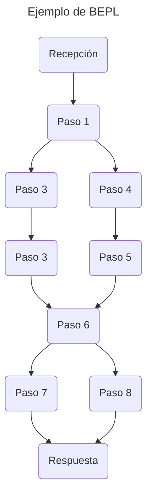

# 1. Introducción
## ¿Qué es BPEL?
Este es un lenguaje estándar del sector de IT que sirve para implementar un servicio que requiere de diferentes componentes que requieren ser orquestados. Se relaciona con las especificaciones WSDL y el esquema XML.

Este modelo de proceso está influenciado por el modelo de servicios WSDL. La definición de un **proceso de negocio** WS-BPEL sigue el modelo de separación de WSDL entre:

- Contenido abstracto de los mensajes utilizados por el proceso de negocio.
- Información de despliegue (mensajes y tipo de puerto vs. enlace e información de dirección).

## Historia
El Lenguaje de Ejecución de Procesos de Negocio para Servicios Web (BPEL4WS) se concibió inicialmente en julio de 2002 con la publicación de la especificación BPEL4WS 1.0, un esfuerzo conjunto de IBM, Microsoft y BEA, inspirado en variaciones previas como el Lenguaje de Flujo de Servicios Web (WSFL) de IBM y la especificación XLANG de Microsoft.

La versión 1.1, con contribuciones de SAP y Siebel, se publicó menos de un año después, en mayo de 2003. Posteriormente, la especificación se presentó a un comité técnico de OASIS para que pudiera convertirse en un estándar oficial y abierto.

El Comité Técnico WS-BPEL de OASIS estuvo activo desde abril de 2003 hasta mayo de 2007, copresidido por Diane Jordan de IBM y John Evdemon de Microsoft. En abril de 2007, WS-BPEL versión 2.0 fue aprobado como Estándar OASIS. Más de 37 organizaciones colaboraron en el desarrollo de WS-BPEL, incluyendo representantes de Active Endpoints, Adobe Systems, BEA Systems, Booz Allen Hamilton, EDS, HP, Hitachi, IBM, IONA, Microsoft, NEC, Nortel, Oracle, Red Hat, Rogue Wave, SAP, Sun Microsystems, TIBCO, webMethods y otros miembros de OASIS.

# 2. Análisis técnico de BEPL
A continuación se detallará más a fondo las características de este estándar.

## Características principales
BEPL tiene ciertas características que se tienen que tomar en cuenta para implementarlo.
### Actividades Estructuradas
Hay diferentes actividades estructuradas para definir el flujo de un proceso, tales como:

- Sequence: Para la ejecución secuencial de actividades.
- Flow: Para la ejecución paralela de actividades.
- If/Else: Para ejecución condicional de las actividades.
- While/RepeatUntil: Para ejecución iterativa.
- Switch: Para ejecución de múltiples ramas.

### Interacción entre servicios
También tiene mecanismos para la interacción entre servicios con actividades como `<invoke>`, `<receive>` y `<reply>` para manejar mensajes de entrada y salida.

### Manejo de datos
Para el manejo de datos se cuenta con `<assign>` para copiar datos entre variables además de soporte para Xpath para manipular XML.

### Manejo de excepciones
BPEL provee de mecanismos para excepciones muy robustos. Por ejemplo el bloque `<catch>` y `<catchall>` por si ocurren errores durante la ejecución, así como `<compensation>` para deshacer actividades completas en caso de errores posteriores.

### Comunicación asíncrona
Hay soporte para patrones de comunicación asíncrona para no bloquear el proceso y gestionar operaciones de larga duración.

## Fortalezas y debilidades
Las ventajas de BEPL son las siguientes:
- Estandarización: Este es un estándar hecho por un conglomerado de diferentes compañías lider en el área de servicios web como IBM y Microsoft por ejemplo.
- Manejo de estados: En el estándar está integrado el manejo del estado de procesos de negocio. Esto permite el uso de variables para almacenarlas a largo plazo.
- Integración de aplicaciones empresariales: Tiene una manera muy opinionada de gestionar los servicios, por lo que permite hacer aplicaciones mejor integradas bajo una empresa.
- Integración entre diferentes empresas: Permite una integración más sencilla y efectiva con socios comerciales, al definir de manera clara las interacciones entre sus sistemas.

Sus debilidades son:
- Curva de aprendizaje: Por su estructura tan rígida hay que aprender muchos conceptos y estructuras.
- Díficil de desarrollar inicialmente: Requiere de un gran trabajo para simplemente levantar los servicios correspondientes.
- Díficil de depurar: Por ser distribuido y asíncrono los procesos pueden dificultar la identificación y resolución de errores.

## Comparación con otros estándares

<table class="tg"><thead>
  <tr>
    <th class="tg-0lax"></th>
    <th class="tg-cly1">BEPL</th>
    <th class="tg-cly1">BPMN</th>
    <th class="tg-cly1">Microsoft Azure Integration Services</th>
    <th class="tg-cly1">FBP</th>
  </tr></thead>
<tbody>
  <tr>
    <td class="tg-cly1">Enfoque</td>
    <td class="tg-cly1">Lenguaje ejecutable basado en XML, diseñado para definir y orquestar procesos de negocio mediante la interacción con servicios web.</td>
    <td class="tg-cly1">Notación gráfica para modelar procesos de negocio</td>
    <td class="tg-cly1">Es un conjunto de servicios en la nube que ofrece Microsoft Azure para integrar aplicaciones, datos y procesos. No es un único lenguaje, sino un conjunto de herramientas.</td>
    <td class="tg-cly1">Las aplicaciones se construyen conectando componentes que realizan tareas específicas, entre los cuales los datos fluyen como flujos de paquetes estructurados.</td>
  </tr>
  <tr>
    <td class="tg-cly1">Ejecutable</td>
    <td class="tg-0lax">Requiere un  motor de ejecución BPEL para interpretar y ejecutar los procesos definidos en XML.</td>
    <td class="tg-cly1">Si, pero no es su enfoque. Es más para modelar.</td>
    <td class="tg-cly1">Nativo de la nube y sin servidor .</td>
    <td class="tg-cly1">Generalmente asincróno y concurrente.</td>
  </tr>
  <tr>
    <td class="tg-cly1">Facilidad de uso</td>
    <td class="tg-cly1">Alta curva de aprendizaje</td>
    <td class="tg-0lax">Dificultad de aprendizaje moderada.</td>
    <td class="tg-cly1">Fácil de aprender. Requiere menos código.</td>
    <td class="tg-cly1">Fácil de aprender. Los flujos de trabajo son intuituvo</td>
  </tr>
</tbody></table>

# Referencias
- carolgeyer (2007) **History of BPEL** https://web.archive.org/web/20241006111330/https://bpel.xml.org/history _Archivado el 6 de Octubre 2024_.
- IBM (2024) **BPEL Process** https://web.archive.org/web/20240508013541/https://www.ibm.com/docs/es/bpm/8.6.0?topic=types-bpel-process _Archivado el 8 de Mayo 2024_
- Andrews, T., Curbera, F. (May 5, 2003) Business Process Execution Language for Web Services. https://web.archive.org/web/20221006100523/https://download.boulder.ibm.com/ibmdl/pub/software/dw/specs/ws-bpel/ws-bpel.pdf _Archivado el 6 de Octubre 2022_