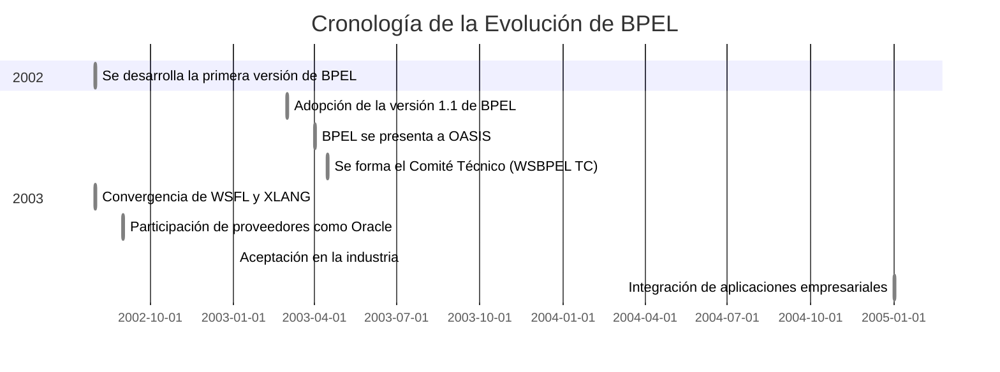

# Introducción y Contexto Histórico

## Definición de BPEL
**¿Qué es BPEL y cuál es su propósito en la orquestación de servicios web?**

BPEL (*Bussiness Process Execution Language*) es un lenguaje pensado para definir y ejecutar procesos de negocio usando servicios web. Está basado en XML y funciona bien con las tecnologías de servicios web, como SOAP, WSDL y UDDI. Nació de la fusión de dos lenguajes anteriores, WSFL y XLANG, combinando ideas de diagramas de flujo y estructuras por bloques, lo que le da mucha flexibilidad para describir procesos.

El objetivo principal de BPEL es ayudar a implementar la Arquitectura Orientada a Servicios (SOA), permitiendo combinar, coordinar y organizar distintos servicios web para crear procesos de negocio más completos. Con BPEL, es relativamente sencillo juntar varios servicios web en uno solo más grande. Se puede controlar exactamente en qué orden se ejecutan (ya sea uno tras otro o al mismo tiempo), manejar condiciones para decidir qué hacer en base a resultados anteriores, repetir acciones con bucles, trabajar con variables y manejar errores si algo falla.

**¿Cómo se relaciona con la arquitectura orientada a servicios (SOA)?**

BPEL es una herramienta clave cuando se trata de implementar una arquitectura orientada a servicios (SOA). Ayuda a crear servicios más grandes a partir de otros más pequeños ya existentes, coordinándolos y organizándolos de forma ordenada. Esto va muy en línea con la idea de SOA, donde las funcionalidades se presentan como servicios reutilizables.

BPEL permite combinar servicios de dos formas principales: orquestación y coreografía. En la orquestación, hay un proceso central que se encarga de dirigir todo, diciendo qué servicio hace qué y cuándo, sin que los servicios involucrados sepan que forman parte de algo más grande. Los procesos que se ejecutan con BPEL siguen este enfoque de orquestación. La coreografía, en cambio, no tiene un "director de orquesta". Cada servicio sabe exactamente cuándo debe actuar y con quién tiene que hablar.

## Evolución Histórica
**Traza la evolución de BPEL desde sus inicios hasta las versiones actuales.** 

**Identifica los hitos clave y los factores que influyeron en su desarrollo.**

A lo largo del tiempo, BPEL ha pasado por varios momentos clave. Todo empezó con su primera versión en agosto de 2002, seguida por la versión 1.1 en marzo de 2003. Poco después, en abril, se presentó a OASIS para su estandarización y se creó el comité técnico WSBPEL. BPEL nació de la combinación de dos lenguajes previos, WSFL (de IBM) y XLANG (de Microsoft), y con el apoyo de empresas como Oracle, fue evolucionando con mejoras importantes.

Varios factores impulsaron su desarrollo, siendo uno de los más importantes la necesidad de implementar SOA (Arquitectura Orientada a Servicios). BPEL facilitó la forma de combinar y coordinar servicios web, permitiendo tanto la integración dentro de una empresa como entre socios comerciales. También ayudó a las organizaciones a mejorar y repensar sus procesos de negocio.

Algo que jugó a su favor fue que se podía implementar sin afectar los sistemas existentes, lo que facilitó las actualizaciones. Con el auge de los servicios web, BPEL se volvió cada vez más relevante, apoyado en tecnologías como XML, SOAP, WSDL y UDDI.

## Impacto Inicial

**Analiza el auge de BPEL en la década de 2000 y su influencia en la integración empresarial.**

BPEL despegó a principios de los 2000, con su primera versión en 2002 y una versión más estable (1.1) ya en 2003. Ese mismo año se presentó a OASIS para estandarizarlo, lo que ayudó a que se adoptara rápidamente. Surgió de la combinación de dos lenguajes previos de IBM y Microsoft, lo que le dio una base sólida y flexible. Empresas como Oracle también se sumaron, impulsando su evolución.

Durante esa década, BPEL fue clave para integrar sistemas dentro de las empresas y facilitar la conexión entre diferentes socios comerciales. Permitió componer servicios web fácilmente, sin necesidad de tocar sistemas existentes, lo cual incentivó la modernización. Además, ayudó a definir y mejorar procesos de negocio, apoyado en tecnologías como XML, SOAP, WSDL y UDDI. Su enfoque de orquestación central también lo hizo muy práctico en escenarios reales.

**Menciona las principales plataformas y herramientas que lo implementaron**

Entre las herramientas más destacadas que usaron BPEL están Oracle BPEL Process Manager y su diseñador integrado, que permiten crear, desplegar y monitorear procesos BPEL desde una consola web. También se menciona el uso de obant, una herramienta basada en Ant para automatizar despliegues más complejos.
Por otro lado, IBM Process Server es otra plataforma importante donde se pueden ejecutar procesos BPEL, con un editor gráfico para diseñarlos fácilmente. En resumen, Oracle y IBM lideraron la implementación práctica de BPEL en esa época.

# Análisis Técnico de BPEL

## Características Principales

**Describe los elementos clave de BPEL: procesos, actividades, variables y socios.**
En BPEL, un **proceso** es básicamente una forma de organizar y ejecutar tareas de negocio usando servicios web. Pueden ser procesos largos, con manejo de errores, eventos asíncronos, y hasta transacciones con compensaciones.

Las **actividades** son los pasos del proceso. Hay actividades simples como invoke (llamar a un servicio), receive (esperar un mensaje), reply (responder), assign (modificar datos), y más. Estas se combinan con estructuras como sequence (orden), flow (en paralelo), switch (condiciones), while (bucles) y pick (esperar eventos).

Las **variables** guardan la info que pasa entre actividades. Se usan para mensajes de entrada y salida, y se definen con tipos XML o WSDL.

Los **socios** (partners) son los servicios externos con los que el proceso interactúa. Se definen usando partnerLink, que indica los roles y operaciones de cada lado (el proceso y el socio).

**Explica cómo BPEL permite definir flujos de trabajo complejos e interacciones entre servicios.**

BPEL permite armar flujos bastante complejos combinando actividades. Puedes ejecutar tareas en orden (sequence), en paralelo (flow), con condiciones (switch o if), repetirlas (while) o esperar distintos eventos (pick).

Para hablar con otros servicios, BPEL usa partnerLink y la actividad invoke. Puede esperar respuestas (receive) o responder a clientes (reply). Soporta tanto llamadas síncronas como asíncronas. Todo esto se basa en WSDL, lo que hace que la comunicación esté bien definida. También puedes orquestar servicios (un proceso los coordina) o usar coreografía (todos saben cómo interactuar sin un "jefe" central).

A continuación se muestra un diagrama con su diagrama de flujo con switches y tareas en paralelo y orden sobre una agencia de Viaje: 

## Fortalezas y Debilidades

**Evalúa las ventajas de BPEL: orquestación de servicios y manejo de transacciones.**
Una gran ventaja de BPEL es que te permite coordinar varios servicios web y combinarlos en procesos más grandes (lo que encaja perfecto con la idea de SOA). Puedes definir el orden en que se ejecutan, ya sea uno tras otro o en paralelo, y meter condiciones, bucles, etc., todo para armar flujos de trabajo bastante complejos. La orquestación le da el control a un proceso central que va guiando todo.

También maneja transacciones extendidas: si algo falla a mitad del proceso, puedes compensar lo que ya se hizo usando la actividad compensate, lo que ayuda a mantener la coherencia incluso cuando las cosas salen mal.

**Identifica sus limitaciones: complejidad, rigidez y adaptabilidad a entornos ágiles.**

Aunque potente, BPEL no es perfecto. Puede volverse complejo si el proceso tiene muchas actividades y condiciones. Aunque haya editores visuales, al final trabajas con XML y eso puede ser un lío de mantener.

Otra pega es que es bastante rígido. Cambiar un servicio o ajustar la lógica puede implicar rehacer buena parte del proceso.

Y en entornos ágiles no encaja del todo bien. BPEL tiene un enfoque más tradicional: definir WSDLs, diseñar el proceso, desplegarlo y probar, lo cual no es muy ágil. Además, depende de servidores específicos y no es tan fácil moverlo a arquitecturas más ligeras o basadas en la nube.

## Comparación con Otros Estándares
**Compara BPEL con otros estándares de orquestación, como BPMN.**

BPEL (Business Process Execution Language) es un lenguaje basado en XML que está diseñado específicamente para la orquestación de servicios web. Utiliza una sintaxis estructurada con etiquetas como sequence, invoke, y receive, lo que permite definir de manera precisa el flujo de trabajo y las interacciones entre los servicios. Sin embargo, esta sintaxis XML puede ser compleja para los usuarios no técnicos, ya que se enfoca en un formato ejecutable legible por máquinas. Además, BPEL está muy centrado en los servicios web, lo que lo hace ideal para procesos que requieren invocar o coordinar múltiples servicios a través de WSDL y SOAP.

Por otro lado, BPMN (Business Process Model and Notation) utiliza una notación gráfica para modelar procesos de negocio, lo que facilita la comprensión del flujo del trabajo por parte de analistas de negocio y otros interesados no técnicos. BPMN es más flexible que BPEL, ya que no está atado a servicios web y puede modelar una variedad más amplia de procesos de negocio, incluidos aquellos que implican interacción humana o procesos internos. Aunque su enfoque visual es más intuitivo, los modelos BPMN generalmente deben ser convertidos en un formato ejecutable a través de herramientas adicionales, como motores de flujo de trabajo, lo que agrega una capa de complejidad a su ejecución.

**Analiza las diferencias en sintaxis, flexibilidad y facilidad de uso.**
- Sintaxis.
BPEL tiene una sintaxis más técnica basada en XML, lo que lo hace legible por máquinas pero complicado para las personas no técnicas. En comparación, BPMN se enfoca en una representación visual con gráficos que facilitan la comprensión del flujo del proceso y la interacción entre las distintas partes del sistema.

- Flexibilidad.
BPEL está centrado en servicios web y su estructura lo hace perfecto para escenarios en los que los servicios están expuestos como web services. Es muy eficaz para orquestar procesos donde se invocan otros servicios, pero no es tan flexible si el proceso requiere una gran interacción humana o procesos internos complejos. Por otro lado, BPMN es más flexible y puede modelar una gama más amplia de procesos, incluidos aquellos con interacción humana, sin estar atado a una tecnología de ejecución específica.

- Facilidad de uso.
BPEL puede ser más difícil de manejar debido a su dependencia de XML, lo que hace que la gestión de procesos complejos sea más desafiante, aunque existen herramientas gráficas para ayudar. BPMN, al ser visual, es generalmente más intuitivo y fácil de entender, lo que lo convierte en una excelente opción para la comunicación entre equipos técnicos y no técnicos. Sin embargo, para ejecutar un modelo BPMN, se necesita convertirlo en un formato ejecutable, como BPEL o utilizar un motor específico para ello.
# Estado Actual y Tendencias

## Declive Relativo
**Explica por qué BPEL ha perdido terreno frente a otras tecnologías.**

A pesar de las capacidades para la orquestación de servicios web y el manejo complejo de errores y transacciones de BEPL, este ha perdido terreno frente a otras tecnologías debido a varias razones. Una de ellas es su inherente complejidad, especialmente en la definición de procesos de negocio muy elaborados.

Y aunque el editor de procesos utiliza representaciones visuales, la base del lenguaje en XML puede volverse intrincada y difícil de mantener para procesos extensos, limitando su facilidad de uso en escenarios complejos. Además, BPEL tiende a ser rígido y menos adaptable a cambios frecuentes en los requisitos del negocio.

**Analiza el impacto de la arquitectura de microservicios y las APIs.**
## Tecnologías de Reemplazo
**Explora cómo las plataformas de Low-Code/No-Code y la RPA transforman la automatización de procesos.**

Las plataformas Low-Code/No-Code han democratizado la automatización de procesos al permitir que usuarios sin conocimientos avanzados de programación puedan diseñar y ejecutar flujos de trabajo complejos mediante interfaces visuales. Esto ha acelerado el desarrollo de soluciones empresariales, reduciendo la dependencia del área de TI y permitiendo una respuesta más rápida a los cambios del negocio. Además, estas plataformas fomentan la colaboración entre perfiles técnicos y no técnicos, facilitando la alineación entre necesidades operativas y soluciones tecnológicas.

Por su parte, la Automatización Robótica de Procesos (RPA) permite automatizar tareas repetitivas a nivel de interfaz de usuario, simulando la interacción humana con sistemas existentes sin necesidad de modificarlos. Esto resulta especialmente útil para integrar aplicaciones heredadas o desconectadas. Combinadas, las soluciones Low-Code y RPA están transformando la forma en que las organizaciones automatizan sus procesos, haciéndolo más accesible, ágil y rentable.

**Analiza el impacto de los sistemas de orquestación de contenedores, y de los "Service Mesh" en la gestión de los procesos.**

Los sistemas de orquestación de contenedores, como Kubernetes, han revolucionado la forma en que se despliegan y gestionan aplicaciones distribuidas, permitiendo una automatización eficiente del escalado, la recuperación ante fallos y el despliegue continuo. En el contexto de los procesos de negocio, estas herramientas permiten una ejecución más flexible y escalable de servicios individuales, lo que es especialmente útil en arquitecturas basadas en microservicios.

Los "Service Mesh", como Istio o Linkerd, complementan esta orquestación al encargarse de la comunicación entre servicios de manera transparente, gestionando aspectos como el enrutamiento, la seguridad y el monitoreo sin modificar el código de los servicios. Esto facilita la implementación de procesos distribuidos complejos, con mayor visibilidad, resiliencia y control, transformando la gestión de procesos en entornos altamente dinámicos y escalables.

## El Papel de BPMN

**Explica el ascenso de BPMN como estándar dominante para el modelado de procesos.**

A diferencia de BPEL, que usa XML, BPMN permite modelar procesos con una notación gráfica mucho más visual e intuitiva. Eso lo hace más accesible no solo para desarrolladores, sino también para analistas de negocio y otros perfiles no técnicos. Esta facilidad de comunicación entre roles probablemente fue clave para su adopción generalizada.

**Compara BPMN con BPEL en flexibilidad, facilidad de uso y adopción.**

BPMN es más fácil de usar para quienes no son técnicos, gracias a su enfoque visual. BPEL, aunque tiene editores gráficos, sigue basándose en XML, lo cual puede ser más complicado. En cuanto a flexibilidad, BPEL está muy centrado en servicios web, mientras que BPMN se adapta mejor a distintos tipos de procesos. También influye que BPMN es más neutral en cuanto a plataformas, mientras que BPEL ha estado más limitado a entornos específicos como IBM Process Server.

## Casos de Uso Actuales

 **Analiza donde se sigue utilizando BPEL, y explica las razones de su uso actual en esos casos.**

Aunque BPEL ya no es tan popular como antes, todavía se usa en empresas con una arquitectura SOA bien establecida y mucha inversión en servicios web. En estos casos, BPEL sigue siendo útil para orquestar procesos complejos que requieren coordinar varios servicios, sobre todo cuando hay transacciones largas, manejo de errores o eventos asíncronos. Si ya tienen todo montado con servicios web, BPEL encaja bien como solución.

 **¿Cuándo tiene sentido seguir usando BPEL?**

Vale la pena seguir con BPEL si ya tienes muchos procesos hechos con esta tecnología y cambiar todo sería costoso o arriesgado. También tiene sentido cuando necesitas una orquestación robusta de servicios web, con control de errores y transacciones bien gestionado. Eso sí, hay que tener en cuenta que es más rígido y depende de plataformas específicas como IBM Process Server, lo cual puede limitar su uso en nuevos proyectos.

# Conclusiones y Perspectivas Futuras

## Resumen del Estado del Arte

**Sintetiza los hallazgos clave sobre la evolución y el estado actual de BPEL.**

BPEL permitió estandarizar la orquestación de servicios web en entornos empresariales, ofreciendo un lenguaje formal para describir procesos de negocio complejos. Su estructura basada en XML y su enfoque en SOA facilitaron la automatización de flujos de trabajo y la reutilización de servicios, marcando un avance importante en la gestión de procesos distribuidos.

BPEL nació en 2002 como una iniciativa conjunta de IBM y Microsoft bajo el estándar OASIS. Durante sus primeros años, tuvo una adopción significativa gracias a su integración con herramientas empresariales. Sin embargo, con el tiempo, perdió popularidad frente a modelos más visuales como BPMN 2.0 y enfoques más ágiles como los microservicios.

Actualmente, BPEL se encuentra en desuso activo, aunque sigue presente en algunas infraestructuras heredadas que aún dependen de arquitecturas SOA. Su falta de evolución, la escasa adopción en entornos modernos y el surgimiento de tecnologías más flexibles han relegado a BPEL a un rol marginal en el desarrollo de procesos empresariales.

## Perspectivas Futuras
**Analiza las tendencias futuras en la orquestación de servicios y la automatización de procesos.**

Hay una tendencia hacia arquitecturas más flexibles como los microservicios, donde se prefieren herramientas menos complejas y más adaptables. Las APIs ligeras, la automatización basada en eventos y los enfoques que permiten cambios rápidos están marcando el rumbo. Tecnologías que sean fáciles de integrar y que funcionen en distintas plataformas probablemente van a dominar el futuro.

**Considera el posible papel de BPEL en el futuro.**

BPEL todavía podría tener un lugar en organizaciones que ya invirtieron en infraestructura SOA y servicios web basados en SOAP. Para esos casos, sigue siendo útil por su manejo de orquestación compleja y errores. Pero para nuevos proyectos, su rigidez y dependencia de plataformas específicas lo hacen menos atractivo. Es probable que quede como una opción de nicho, más que como una tecnología de referencia.

# Referencias

<!-- * Lista de fuentes confiables y actualizadas utilizadas en el reporte. -->
 [A Hands-on Introduction to BPEL. ](https://www.oracle.com/technical-resources/articles/matjaz-bpel.html)

[Bussiness Process Execution Language](https://www.techtarget.com/searchapparchitecture/definition/BPEL-Business-Process-Execution-Language)

[Proceso BPEL](https://www.ibm.com/docs/es/bpm/8.6.0?topic=types-bpel-process)

[A BPEL Process Activities and Service](https://docs.oracle.com/middleware/12211/soasuite/develop/GUID-0BF8C017-AD22-415A-BE56-A5A013A7247E.htm#SOASE2070)