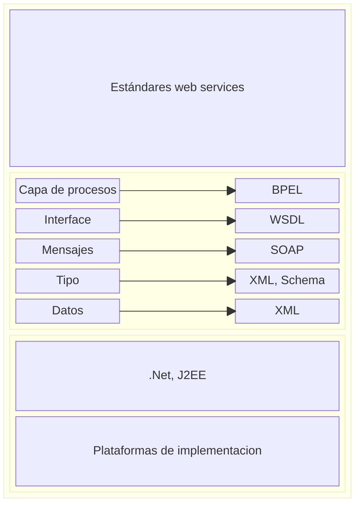
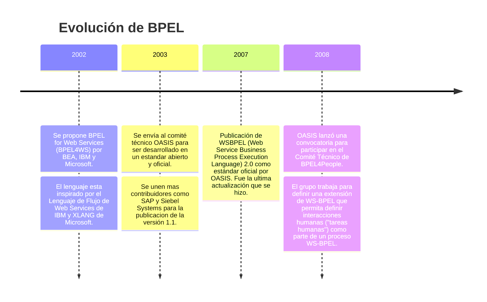
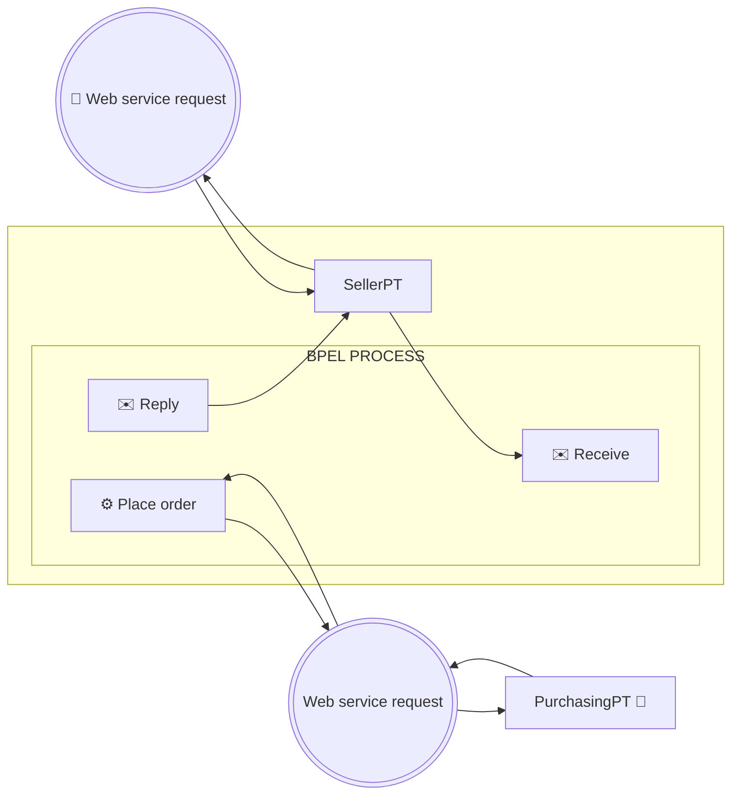

<em> <small> <p style="text-align:right;">Rosa Elena Palma y Meza Buelna</p> </small> </em>

# BPEL (Business Process Execution Language) 

## Contenido
  - [Introducción y contexto histórico](#introduccion-y-contexto-historico)
    - [Definición de BPEL](#definicion-de-bpel)
    - [Evolución Histórica](#evolucion-historica)
    - [Impacto Inicial](#impacto-inicial)
  - [Análisis Técnico de BPEL](#analisis-tecnico-de-bpel)
    - [Características Principales](#caracteristicas-principales)
    - [Fortalezas y Debilidades](#fortalezas-y-debilidades)
    - [Comparación con Otros Estándares](#comparacion-con-otros-estandares)
  - [Estado Actual y Tendencias](#estado-actual-y-tendencias)
    - [Declive Relativo](#declive-relativo)
    - [Tecnologías de Reemplazo](#tecnologias-de-reemplazo)
    - [El Papel de BPMN](#el-papel-de-bpmn)
    - [Casos de Uso Actuales](#casos-de-uso-actuales)
  - [Conclusiones y Perspectivas Futuras](#conclusiones-y-perspectivas-futuras)
    - [Resumen del Estado del Arte](#resumen-del-estado-del-arte)
    - [Perspectivas Futuras](#perspectivas-futuras)
  - [Referencias](#referencias)

<h2 id="introduccion-y-contexto-historico">Introducción y contexto histórico</h2>

<h3 id="definicion-de-bpel">Definición de BPEL <a href="#contenido">↑</a></h3>

BPEL, traducido al español como "Lenguaje de Ejecución de Procesos de Negocio", como dice su nombre, se trata de un lenguaje que hace que los procesos sean programables y fáciles de implementar.

Está basado en el esquema XML, SOAP y WSDL (Web Services Description Language), lo cual permite interconectar APIs y procesos humanos y hace posible compartir datos en un flujo de trabajo de negocio. 

``` mermaid
    block-beta
    block
    columns 1
    A["Estándares web services"]

    block
    columns 3
    B["Capa de procesos"] space C["BPEL"]
    B-->C

    D["Interface"] space E["WSDL"]
    D-->E

    F["Mensajes"] space G["SOAP"]
    F-->G

    H["Tipo"] space I["XML, Schema"]
    H-->I

    J["Datos"] space K["XML"]
    J-->K
    end

    block
    columns 1
    L[".Net, J2EE"]
    M["Plataformas de implementacion"]
    end

    end
```
Proporciona una manera relativamente sencilla y directa de componer varios servicios web en nuevos servicios compuestos denominados procesos de negocio.
Gracias a BPEL es posible la implementación descendente de SOA mediante la composición, orquestación y coordinación de servicios web. 


El objetivo principal de BPEL es estandarizar el formato de la definición del flujo de procesos de negocio para que las empresas puedan colaborar fluidamente mediante servicios web. Amplía el modelo de interacción de los servicios web y le permite soportar transacciones comerciales. Se basa en los servicios web, ya que se asume que cada proceso de negocio involucrado se implementa como un servicio web. 

Los procesos escritos en BPEL pueden orquestar interacciones entre servicios web mediante documentos XML de forma estandarizada. Estos procesos pueden ejecutarse en cualquier plataforma o producto que cumpla con la especificación BPEL.

> ✅ **El lenguaje BPEL permite:**
>- Enviar y recibir mensajes asíncronamente desde servicios remotos.
>- Manipular estructuras de datos XML
>- Administrar eventos y excepciones
>- Diseñar flujos paralelos de ejecución de procesos
>- Deshacer porciones de procesos cuando ocurren excepciones

<h3 id="evolucion-historica">Evolución Histórica <a href="#contenido">↑</a></h3>


```mermaid
timeline
    title Evolución de BPEL
    2002 : Se propone BPEL for Web Services (BPEL4WS) por BEA, IBM y Microsoft.
         : El lenguaje esta inspirado por el Lenguaje de Flujo de Web Services de IBM y XLANG de Microsoft.
    2003 : Se envía al comité técnico OASIS para ser desarrollado en un estandar abierto y oficial.
         : Se unen mas contribuidores como SAP y Siebel Systems para la publicacion de la versión 1.1.
    2007 : Publicación de WSBPEL (Web Service Business Process Execution Language) 2.0 como estándar oficial por OASIS. Fue la ultima actualización que se hizo.
    2008 : OASIS lanzó una convocatoria para participar en el Comité Técnico de BPEL4People. 
         : El grupo trabaja para definir una extensión de WS-BPEL que permita definir interacciones humanas ("tareas humanas") como parte de un proceso WS-BPEL.

```

**Objetivos generales**  
Se tiene un total de 10 objetivos generales y principios que formaron la base del trabajo de los autores originales de la especificación BPEL4WS.


1. Definir procesos de negocio mediante servicios web para ayudarles a interactuar con entidades externas.
2. Usar un lenguaje basado en XML para satisfacer todas las necesidades empresariales.
3. Incorporar capacidades de orquestación de servicios web en el lenguaje, tanto para procesos de negocio abstractos como ejecutables.
4. Utilizar estructuras tanto jerárquicas como en forma de grafo para reducir la fragmentación.
5. La funcionalidad de manipulación y análisis de datos está incorporada en el lenguaje.
6. Soporta un mecanismo de identificación.
7. Creación y terminación de procesos como parte del mecanismo básico del ciclo de vida.
8. Definir un modelo de transacción que incluya técnicas como acciones de compensación y alcance (scoping).
9. Los servicios web son el modelo subyacente.
10. Toda la funcionalidad se basa en y amplía el estándar de servicios web.

Los beneficios que BPEL pueden brindar a la compañía, a través de los 10 objetivos generales propuestos son: 

- Automatización a larga escala
- Orquestación de procesos automatizados
- Fácil integración de servicios web

**De BPEL4WS 1.1 A WS-BPEL 2.0**

BPEL4WS 1.1 se presentó al Comité Técnico WS-BPEL de OASIS, donde avanzó a través de un proceso abierto.

Estas fueron algunas de las mejoras presentadas en la versión WS-BPEL 2.0: 

***Acceso de datos*** 

- Las variables se pueden declarar mediante tipos complejos del esquema XML.
- Las expresiones XPath se simplifican mediante el uso de la notación "$" para el acceso a variables.
- El acceso a los mensajes WSDL se ha simplificado mediante la asignación directa de partes del mensaje WSDL a variables de elemento/tipo del esquema XML.
- Se ha añadido la capacidad de validar datos XML, tanto como una opción de la actividad \<assign> como como una nueva actividad \<validate>.
- Se ha añadido la inicialización de variables como parte de la declaración de variables.

***Modelo de Ámbito***
- Se ha definido una nueva semántica de instantáneas de ámbito.
- Se ha aclarado la gestión de fallos durante la compensación.
- Se ha aclarado la interacción entre el aislamiento del ámbito y los enlaces de control.
- Se ha enriquecido el modelo de detección de fallos.

***Operaciones de mensajes***

- Se ha añadido la opción join a los conjuntos de correlación para permitir que varios participantes se reúnan en el mismo proceso con un orden determinista.
- El enlace de socio ahora se puede declarar localmente a un ámbito.
- Se ha añadido la opción initializePartnerRole para especificar si la referencia del punto final debe estar vinculada a un enlace de socio durante la implementación.
- Se ha añadido la construcción messageExchange para emparejar las actividades concurrentes \<receive> y \<reply>.

***Nuevas actividades***

- Se ha añadido \<forEach> en serie y en paralelo con una condición de finalización opcional.
- Se ha añadido \<repeatUntil>.
- Se ha añadido una nueva actividad de extensión.
- Se ha cambiado \<switch> a \<if>-\<elseif>-\<else>.
- Se ha cambiado \<terminate> a \<exit>.
- Se han diferenciado los casos de \<compensate> renombrándolos como \<compensate> y \<compensateScope>.

***Cambios varios***

- Se ha añadido la función de alarma repeatEvery a los controladores de eventos.
- Se ha aclarado la resolución de recursos (p. ej., Variable, enlace de socio) para controladores de eventos
- Se añadió compatibilidad formal con \<documentation>
- Se añadieron declaraciones de espacio de nombres de extensión para especificar qué extensión debe entenderse
- Se añadió compatibilidad con \<import> para importar WSDL y XSD formalmente

***Procesos Abstractos***

- Se aclararon los patrones de uso de los Procesos Abstractos
- Se introdujeron los Perfiles Abstractos para abordar las diferentes necesidades de los Procesos Abstractos, y dos perfiles, «Comportamiento Observable» y «Plantilla de Proceso», incluidos en la especificación


<h3 id="impacto-inicial">Impacto Inicial <a href="#contenido">↑</a></h3>

Dentro de la empresa, BPEL se utiliza para estandarizar la integración de aplicaciones empresariales, así como para extender la integración a sistemas previamente aislados. Entre empresas, BPEL facilita y hace más eficaz la integración con los socios comerciales.

Este lenguaje impulsa a las empresas a definir mejor sus procesos de negocio, lo que a su vez conduce a la optimización, reingeniería y selección de los procesos más adecuados, optimizando aún más la organización. Las definiciones de procesos de negocio descritas en BPEL no afectan a los sistemas existentes, lo que fomenta las actualizaciones. 

BPEL orquesta procesos, lo que genera tres beneficios distintivos para las empresas:

- Acceso más fácil a los datos y servicios
- Mayor agilidad empresarial
- Integrar nuevos servicios es económico

Cuando una empresa requiere acceder a servicios tanto internos como externos para su funcionamiento, BPEL puede integrar ambos y tener los datos disponibles en un lugar centralizado. 

El uso de servicios web externos en realidad suma al proceso de automatización general: los servicios web manejan tanto procesos comerciales abstractos como procesos comerciales ejecutables, lo que permite que su personal dedique más horas humanas a lo que necesita.

Cuando hay nuevos aspectos de infraestructura, estos pueden ser integrados inmediatamente con BPEL y servicios web, permitiendo una mejora a gran escala a los procesos de negocio. 

Cuando se agregan aplicaciones o infraestructuras nuevas, pueden integrarse con nuevas descripciones de procesos. Los cambios a gran escala pueden causar muchos problemas para muchas organizaciones, pero la administración de procesos de BPEL permite que sea más sencillo. 

Algunos programas que ofrecen BPEL son 

- Microsoft BizTalk
- Oracle BPEL Process Manager
- SAP PowerDesigner
- IBM Business Automation Workflow
- Eclipse BPEL Designer

<h2 id="analisis-tecnico-de-bpel">Análisis Técnico de BPEL</h2>

<h3 id="caracteristicas-principales">Características Principales <a href="#contenido">↑</a></h3>

Un proceso BPEL es un conjunto de servicios web cuyas interacciones se organizan de forma definida. Cada servicio es un participante que realiza algún tipo de procesamiento. Los servicios pueden ser muy granulares (por ejemplo, calcular una tarifa) o de gran alcance (por ejemplo, procesar un pedido).

El proceso de negocio que se crea tiene una configuración para "crear una instancia", de modo que cada vez que llega una nueva orden de compra, por ejemplo, se crea un nuevo proceso. Este nuevo proceso gestiona todas las interacciones relacionadas, manteniendo las interacciones separadas para cada orden de compra y cada comprador.

La definición del proceso BPEL utiliza como entrada las definiciones de los archivos del Lenguaje de Descripción de Servicios Web (WSDL). Estos archivos contienen información de la interfaz que puede compartirse con el mundo exterior. Un desarrollador de procesos selecciona información como los tipos de enlaces de socios y las operaciones para definir los pasos del proceso.

Un proceso BPEL coordina estas interacciones y las compone en un flujo continuo o de larga duración. Por ejemplo, si se produce una excepción durante la ejecución de un proceso, las actividades podrían revertirse o deshacerse, y un proceso BPEL proporciona las técnicas de correlación, compensación y gestión de fallos y eventos.

En la siguiente figura, el proceso representa al participante Vendedor (Seller participant o SellerPT), quien acepta una orden de compra de un cliente mediante un mensaje de entrada de servicio web. A continuación, el Vendedor realiza el pedido al participante Comprador (Purchasing participant o PurchasingPT). Para finalizar el proceso, el proceso confirma al cliente si el pedido se completó.


```mermaid
    flowchart LR
     A((("🧍 Web service request"))) --> B
    B --> A

    
    subgraph titulo [" "]
        B[SellerPT]
        subgraph BPEL PROCESS 
        direction TB
            C[✉️ Receive]
            D[✉️ Reply]
            E[⚙️ Place order]
        
        end
    end 

    F((("Web service request")))
    G[PurchasingPT 🧍 ]

    B --> C
    D --> B
    F --> E --> F
    F --> G --> F

```

El código fuente de un proceso contiene los siguientes elementos clave: 
- Elemento de proceso
- Enlaces de socios
- Variables 
- Actividades

**Elemento de proceso: Definición del nombre y el espacio de destino**

El elemento de proceso, que aparece primero, define el nombre y el espacio de destino especificados.

```XML
<process name="SyncHelloWorld"
     targetNamespace="http://tutorial.oracle.com"
     suppressJoinFailure="yes" xmlns:tns="http://tutorial.oracle.com"
     xmlns="http://schemas.xmlsoap.org/ws/2003/03/business-process/"
     xmlns:bpelx="http://schemas.oracle.com/bpel/extension">
```

**Enlaces de socios: Definición de servicios que este servicio utiliza**

Después del elemento de proceso se encuentran los enlaces de socio, que definen los demás servicios o procesos con los que interactúa el proceso. En este caso, el único enlace de socio creado automáticamente por el asistente es el de la interfaz de cliente para este proceso BPEL.

```XML
<partnerLinks>
<!-- Comments... -->
     <partnerLink name="client"      
          partnerLinkType="tns:SyncHelloWorld"
          myRole="SyncHelloWorldProvider"/>  
</partnerLinks>
          
```

**Variables globales: Variables accesibles durante el proceso** 

Después de los enlaces de socios, se definen las variables globales accesibles durante el proceso. El asistente para Nuevo Proyecto crea automáticamente variables globales para los mensajes de entrada y salida del proceso. Como se vio anteriormente, los tipos de estas dos variables se definen en el WSDL del proceso.

```XML

<variables>     <!-- Reference to the message passed as input during initiation -->
     <variable name="input"
          messageType="tns:SyncHelloWorldRequestMessage"/>
     <!-- Reference to the message that will be returned to the requester -->
     <variable name="output"
          messageType="tns:SyncHelloWorldResponseMessage"/>
</variables>

```

**Cuerpo principal del proceso: Definición de la actividad BPEL**

Después de las variables globales se encuentra el cuerpo principal del proceso, que es cualquier actividad BPEL. Esta suele ser una actividad compuesta que contiene subactividades. 

Al crear un nuevo proceso síncrono, el asistente para Nuevo Proyecto crea una secuencia (que en BPEL es un conjunto de actividades ejecutadas secuencialmente) que contiene una actividad de recepción para obtener el mensaje de entrada del cliente e iniciar el proceso.

 A esto le sigue una actividad de respuesta para devolver el resultado sincrónicamente al cliente.

```XML
<sequence name="main">
     <!-- Receive input from requester.
          Note: This maps to operation defined in SyncHelloWorld.wsdl -->
     <receive name="receiveInput" partnerLink="client"
          portType="tns:SyncHelloWorld"
          operation="process" variable="input"
          createInstance="yes"/>
     <reply name="replyOutput"
          partnerLink="client"
          portType="tns:SyncHelloWorld"
          operation="process"
          variable="output"/>
</sequence>
``` 

Finalmente, se cierra el proceso:

```XML
</process>
```

<h3 id="fortalezas-y-debilidades">Fortalezas y Debilidades <a href="#contenido">↑</a></h3>

| Fortalezas      | Debilidades |
| ----------- | ----------- |
| Ayuda a definir estándares de procesos, permitiendole a distintos proveedores compartir información, mejorando el flujo de datos y comunicación.      | No esta enfocado a desarrollo gráfico de procesos, por lo que no se define como deben ser los diagramas que especifican procesos de negocios.       |
| Permite la orquestación de servicios, lo que permite a las organizaciones integrar y coordinar varios sistemas y servicios de software para ejecutar un proceso de negocio.   | Debido a que se basa mayormente en XML, puede ser complicado de desarrollar y entender.  |
|Permite a las organizaciones adaptar y modificar sus procesos rápidamente en respuesta a las cambiantes necesidades comerciales y condiciones del mercado.  | Aunque se intentó adaptar BPEL para incluir tareas realizadas por personas, no logra representar bien los procesos humanos. Las personas no funcionan como servicios web, y tratar de tratarlas como si lo hicieran no soluciona el problema, ya que los humanos interactúan de forma muy diferente a un sistema automatizado. |
|Automatizar los procesos comerciales, reduciendo el riesgo de errores humanos y aumentando la velocidad de los procesos. |Al principio se pensaba que los procesos en BPEL se podían usar en cualquier plataforma, pero en la práctica cada proveedor le agrega funciones propias. Eso los hace útiles, pero difíciles de usar fuera de su sistema. |
| |El diseño de procesos BPEL eficaces requiere una comprensión profunda de los requisitos comerciales y la lógica de los procesos. |

<h3 id="comparacion-con-otros-estandares">Comparación con Otros Estándares <a href="#contenido">↑</a></h3>

**BPMN**

(Business Process Management Notation), es una **notación gráfica estandarizada**
que permite el modelado de procesos de negocio, en un formato de flujo de trabajo (Workflow).

Se trata de una notación gráfica que describe los pasos y actividades de un proceso de negocio.
Modela tanto la secuencia de actividades como los datos (o mensajes) intercambiados entre
los distintos participantes


Los símbolos BPMN son elementos gráficos que se utilizan en los diagramas BPMN para representar diversos aspectos de los procesos de negocio. Estos símbolos proporcionan una forma estandarizada y visual de documentar, analizar y comunicar flujos de trabajo y actividades complejas dentro de una organización. 

Los símbolos BPMN se pueden clasificar en varios tipos principales según su función en la visualización de los procesos de negocio. El mapeo de procesos de negocio, mediante estos símbolos BPMN, permite a las organizaciones comprender mejor sus flujos de trabajo e identificar áreas de mejora.

Estos son solo algunos de los símbolos utilizados en BPMN: 


**XPDL** 

(XML Process Definition Language), es un **formato de archivo basado en XML que representa el “dibujo”** de la definición del proceso. Guarda el tamaño y las coordenadas X e Y del nodo. Además, los nodos pueden especificar atributos tales como roles, descripción de actividades, timers, llamadas a Servicios Web, entre otros. XPDL ofrece una manera estándar para representar procesos de negocio, de tal manera que puedan ser importados/exportados por cualquier editor BPMN que implemente el estándar, favoreciendo la portabilidad entre diagramas diseñados por herramientas de distintos proveedores

A diferencia de BPEL, que también está basado en XML, XPDL guarda la información gráfica (como coordenadas de los nodos o tamaños) de los diagramas de procesos que se elaboran en BPMN.

Básicamente, XPDL permite llevar un diseño BPMN de una herramienta de diseño a otra sin perder información y BPEL solo comunica el proceso como tal al motor. Generalmente, la herramienta de diseño es la que se encarga de traducir el diseño a BPEL. 

Osea, se puede convertir de BPMN a BPEL, pero no se podría convertir de BPEL a BPMN ya que BPEL no cuenta con información visual y estructura de los gráficos. 

**YAWL** 

(Yet Another Workflow Language) es un **sistema de automatización y gestión de procesos de negocio basado en un lenguaje de modelado** conciso y potente que gestiona transformaciones de datos complejas y se integra completamente con recursos organizacionales, sistemas externos y servicios web. La base formal del lenguaje YAWL permite especificaciones inequívocas y la verificación automatizada.

El sistema YAWL comprende un conjunto extensible de servicios YAWL en una arquitectura orientada a servicios; algunos ofrecen funcionalidad a los usuarios finales, otros interactúan con otros servicios y aplicaciones, y otros realizan ambas funciones. Esta arquitectura proporciona un entorno que puede ajustarse fácilmente a necesidades específicas o extenderse a nuevos dominios según sea necesario.

Consta de un editor para la definición de especificaciones de proceso y un motor para su ejecución. Las especificaciones de proceso contienen todas las perspectivas necesarias para la automatización de procesos: el flujo de control, los recursos y los datos. El flujo de control se edita como una secuencia de tareas en formato gráfico, como se muestra en la siguiente figura.


<h2 id="estado-actual-y-tendencias">Estado Actual y Tendencias</h2>

<h3 id="declive-relativo">Declive Relativo <a href="#contenido">↑</a></h3>

Al principio, cuando se creó BPMN, se pensaba que la idea era convertir esos diseños a BPEL, porque BPEL era el lenguaje que entendían los motores de ejecución. Pero con el tiempo, esa idea fue perdiendo fuerza. Eventualmente, las siguientes actualizaciones de BPMN ya no estuvieron pensadas para traducirse a BPEL.

**En lugar de eso, se propuso un nuevo formato de archivo para guardar y compartir los diagramas, dejando de lado a BPEL.**

Las grandes empresas también se alejaron de BPEL:

Microsoft al principio pensó usar BPEL como un formato para intercambiar procesos, pero al final **prefirió usar su propio sistema interno.**

Oracle, que había comprado una empresa muy buena en BPEL (Collaxa), incluso mejoró BPEL para que se pudiera usar como formato de ida y vuelta con BPMN.
Pero con el tiempo Oracle también dejó BPEL de lado, y prefirió **interpretar directamente diagramas tipo BPMN, sin tener que traducirlos.**

Los procesos en BPEL no son realmente intercambiables entre diferentes plataformas.

En teoría, un proceso simple que solo llame a servicios web sí funcionaría en cualquier sistema.
Pero en la práctica, cada proveedor (Microsoft, Oracle, etc.) le agrega extensiones propias a BPEL para hacerlo más útil y eso hace que no se pueda mover fácilmente un proceso de un sistema a otro.

#### **APIs y microservicios**

Los microservicios son un enfoque de arquitectura y organización para el desarrollo de software donde el **software está compuesto por pequeños servicios independientes que se comunican a través de API bien definidas**. 

Las arquitecturas de microservicios hacen que las aplicaciones sean más fáciles de escalar y más rápidas de desarrollar. Esto permite la innovación y acelera el tiempo de comercialización de las nuevas características.

Con las arquitecturas monolíticas, todos **los procesos están estrechamente asociados y se ejecutan como un solo servicio**. Esta complejidad dificulta la implementación de nuevas ideas. Las arquitecturas monolíticas aumentan el riesgo de fallos en disponibilidad de la aplicación porque muchos procesos dependientes y estrechamente vinculados aumentan el impacto del error de un proceso.

La diferencia entre BPEL y los microservicios es que BPEL es un lenguaje diseñado para orquestar procesos de negocio complejos, como en aplicaciones monolíticas o sistemas de integración más grandes, donde los pasos del proceso (como invocar varios servicios) se **coordinan en un flujo único**. En cambio, en la arquitectura de microservicios, los servicios son independientes, lo que significa que no necesariamente siguen un flujo único orquestado. Cada servicio es autónomo y tiene su propia API, lo que hace que BPEL, que se basa en la orquestación de procesos, sea menos adecuado para este tipo de estructuras.

> ✅  Las APIs permiten la comunicación entre servicios de forma estándar y sencilla, utilizando protocolos comunes (como HTTP/REST). Cada microservicio expone su funcionalidad a través de una API bien definida, lo que facilita la integración y la modularidad.

Las APIs ofrecen mayor flexibilidad y control sobre cómo se integran los servicios, permitiendo una arquitectura más dinámica. BPEL no está diseñado para trabajar directamente con APIs de una manera tan flexible como los microservicios. Si bien puede invocar servicios web (SOAP), no es tan eficiente cuando se trata de trabajar con APIs RESTful o servicios distribuidos modernos.

> ❌ En cambio, BPEL requiere una orquestación centralizada y un flujo de trabajo predefinido entre los distintos servicios, lo que complica la flexibilidad que los microservicios ofrecen.


<h3 id="tecnologias-de-reemplazo">Tecnologías de Reemplazo <a href="#contenido">↑</a></h3>

**Low Code**  
El Low Code se trata de una alternativa de desarrollo de aplicaciones  más accesible, en la cual no es necesario tener conocimientos extensos de programación o experiencia. En esta alternativa, se puede crear software con interfaces simples y agregar características mediante arrastrar-soltar. En este caso, es posible que sean necesarios conocimientos básicos de programación.  

**No Code**  
Por otro lado, en el desarrollo de aplicaciones de No Code se necesita ningún conocimiento de programación ni lenguajes en absoluto. Cualquier empleado de una organización puede construir aplicaciones que se ajusten al flujo de operaciones de la empresa, sin importar sus habilidades técnicas.

**RPA**  
Robotic Process Automation se trata de un tipo de automatización de tareas repetitivas para el humano integrando APIs y la interface de usuario (UI).

Las herramientas de software de RPA deben contar con:
- Capacidad de desarrollar scripts con Low-Code
- Integración con aplicaciones de la empresa
- Orquestación y administración, incluyendo configuración, monitoreo y seguridad. 

**Orquestación de contenedores**  
Los contenedores son entornos ligeros y aislados que agrupan aplicaciones y  sus dependencias para ejecutarlas de forma coherente e independiente de la plataforma.  
Su orquestación se refiere a la administración, escala y provisión de contenedores. Es indispensable en la arquitectura de microservicios. 

Características:
- Escalado automático: Permite el escalado dinámico de las aplicaciones en función de la demanda actual. 
- Equilibrio de carga: Distribuyen el tráfico de datos entre contenedores.
- Disponibilidad mediante autocuración: Se restauran automáticamente sin necesidad de intervención humana.
- Gestión y optimización de recursos: Supervisan continuamente la utilización y garantizan que sólo reciban los recursos que realmente necesitan.
- Estrategias de despliegue: Permiten a los desarrolladores desplegar nuevas versiones del software de forma incremental o en paralelo con las versiones existentes.

**Service mesh**  
Una malla de servicios es una capa de software que gestiona toda la comunicación entre los servicios de las aplicaciones. Esta capa se compone de microservicios en contenedores. A medida que las aplicaciones escalan y aumenta el número de microservicios, se vuelve difícil supervisar el rendimiento de los servicios. Para gestionar las conexiones entre servicios, una malla de servicios ofrece nuevas funciones como la monitorización, el registro, el rastreo y el control del tráfico. Es independiente del código de cada servicio, lo que le permite funcionar a través de los límites de la red y con múltiples sistemas de gestión de servicios.

**Gestión de procesos**

En una organización donde los trabajos están compuestos por microservicios, la orquestación de contenedores y el Service Mesh pueden ser piezas clave para lograr una buena organización, así como para garantizar la escalabilidad y disponibilidad de los servicios.

Al tener los procesos gestionados y estandarizados, se facilita la realización de tareas por parte de los empleados, además de asegurar la adaptabilidad en caso de un aumento en la carga de trabajo.

<h3 id="el-papel-de-bpmn">El Papel de BPMN <a href="#contenido">↑</a></h3>

Fue desarrollado originalmente por la Business Process Management Initiative (BPMI) en 2004. Sin embargo, en 2005 se produjo una fusión fundamental cuando BPMI unió fuerzas con el Object Management Group (OMG). Esta fusión desempeñó un papel importante en la configuración del futuro de BPMN.

Un año después, en 2006, BPMN fue adoptado formalmente como estándar por OMG, marcando un hito crucial en su desarrollo. El paso de BPMN 1.0 a BPMN 2.0 se produjo en 2010, pero BPMN 2.0 no se publicó oficialmente hasta 2013. El reconocimiento mundial de la norma llegó cuando fue publicada por la Organización Internacional de Normalización (ISO ) con la designación ISO/IEC 19510.

Los factores que contribuyeron a que BPMN se estableciera como el estandar predominante:
- Ser un estándar de representación gráfica de procesos, lo que lo hace clara y comprensible para todos los interesados. 
- Ayuda a las empresas a mejorar los procesos, reducir costos y aumentar la eficiencia al proporcionar un método claro y coherente para modelar y analizar los procesos empresariales.
- Ser reconocido como el estandar de referencia global para el modelado de procesos.

**BPMN vs BPEL**

|                                                    **BPMN**                                                    	|                                                  **BPEL**                                                  	|
|:--------------------------------------------------------------------------------------------------------------:	|:----------------------------------------------------------------------------------------------------------:	|
| Está diseñado para procesos de ejecución más largos, generalmente involucrando a personas para ciertas tareas. 	| Está destinado a procesos totalmente automatizados, principalmente para la orquestación de servicios web.  	|
| Generalmente dura de unos minutos a varias semanas.                                                            	| Los procesos se completan en pocos segundos o menos.                                                       	|
| Es una representación gráfica para especificar los procesos de negocio en un diagrama de procesos de negocio   	| Los procesos se escriben en XML de manera estandarizada para orquestar interacciones entre servicios web.  	|
| Los procesos se pueden interpretar facilmente por todos los involucrados, y su enfoque Low code hace que sea facil diseñarlos.     	| Los procesos solo los pueden diseñar y entender los técnicos familiarizados con el lenguaje XML.                     	|


<h3 id="casos-de-uso-actuales">Casos de Uso Actuales <a href="#contenido">↑</a></h3>

No puedo encontrar empresas que sigan utilizando BPEL explicitamente, pero algunas empresas que utilizan Oracle SOA Suite, que es una herramienta de software que, entre sus servicios, ofrece BPEL, son:

- SAP (USA)
- Beachbody (USA)
- Accenture (Ireland)
- Radar (USA)
- Wix (Israel)
- Deloitte 
- Infosys (India)
- NTT DATA (Japón)
- PwC (United Kingdom)

**✅ Cuándo utilizar BPEL** 
- Se podría recomendar seguir utilizando BPEL si la organización ya tiene una arquitectura de servicios (SOA) establecida, con muchos procesos definidos.  
- BPEL está diseñado para manejar procesos basados en servicios web SOAP, especialmente si se necesita:
    - Transacciones distribuidas
    - Manejo de errores complejo
    - Compensaciones
    - Fiabilidad garantizada 
- También, algunos sectores como bancos, seguros o gobiernos,  pueden requerir entornos más regulados, así que al tener una semántica formal utilizando BPEL puede que sea una mejor opción debido a su definición de procesos y estructura de flujos.
- Si actualmente ya se trabaja con plataformas que utilicen BPEL como 
    - Oracle SOA Suite / BPM Suite
    - IBM WebSphere Process Server (versiones antiguas)
    - OpenESB o WSO2 ESB  

    puede que sea mas conveniente continuar trabajando con ellas, siempre y cuando la plataforma lo permita. 


<h2 id="conclusiones-y-perspectivas-futuras">Conclusiones y Perspectivas Futuras</h2>

<h3 id="resumen-del-estado-del-arte">Resumen del Estado del Arte <a href="#contenido">↑</a></h3>

Desde su estandarización en el 2003, BPEL se consolidó como una de las tecnologías clave para la orquestación de servicios en entornos SOA. Oracle e IBM lo ofrecieron como parte de sus servicios en su software de desarrollo. Su fortaleza se basa en la capacidad de definir procesos estructurados, transaccionales y un gran control sobre el flujo de trabajo. 

Sin embargo, con la evolución de la tecnología, la aparición de la BPMN 2.0 y las arternativas de desarrollo como Low Code o No Code, el interés por BPEL ahora es muy poco. El estándar de BPMN 2.0 han tomado el protagonismo por su enfoque mas cercano al negocio y su facilidad de implementación y comprensión. Además, la adopción de microservicios, APIs REST y plataformas en la nube han desplazado el uso de BPEL hacia sectores muy específicos, donde aún resulta útil por razones de legado, gobernabilidad o cumplimiento de normas. 
<h3 id="perspectivas-futuras">Perspectivas Futuras <a href="#contenido">↑</a></h3>

El futuro de la orquestación de procesos indica que se va a enfocar en desarrollos más ligeros, flexibles y desacoplados, como los proporcionados por las arquitecturas basadas en eventos o el uso de Service Mesh. 
Las herramientas modernas privilegian la visibilidad y escalabilidad dinámica, aspectos en los que BPEL no fue originalmente diseñado para destacar. 

En este caso, BPEL será cada vez menos visto, en donde básicamente solo se encontrará en organizaciones con sistemas heredados donde migrar sería costoso o arriesgado. No se espera un resurgimiento de BPEL como estándar dominante, pero seguirá presente como tecnología de soporte en infraestructuras SOA tradicionales. 

Por otro lado, los lenguajes declarativos centrados en BPMN, flujos de eventos y herramientas Low Code seguirán en crecimiento y serán los medios preferidos para la automatización de procesos. 

<h2 id="referencias">Referencias <a href="#contenido">↑</a></h2>

1. Wright, G. (Dic, 2021) *BPEL (Business Process Execution Language).* Obtenido de https://www.techtarget.com/searchapparchitecture/definition/BPEL-Business-Process-Execution-Language
2. Oracle, *1 Introduction to Oracle BPEL Process Manager.* Obtenido de https://docs.oracle.com/cd/B14099_19/integrate.1012/b14448/introbpel.htm 
3. Miller, A. (5 Oct 2021) *What’s BPEL? Business Process Execution Language Explained.* Obtenido de https://www.bmc.com/blogs/bpel-business-process-execution-language/
4. Matjaz, J. (2019) *A Hands-on Introduction to BPEL.* Obtenido de Oracle.com. https://www.oracle.com/technical-resources/articles/matjaz-bpel.html
5. Carolgeyer (18 Oct 2007) *History of BPEL*. Obtenido de https://bpel.xml.org/history
6. Leymann, F., Roller, D., & Thatte, S. (n.d.). *Goals of the BPEL4WS Specification.* Documento obtenido de https://groups.oasis-open.org/higherlogic/ws/public/document?document_id=3249
*This is a summary of high level design points in the BPEL4WS specification from a few of the original authors.*
7. Carolgeyer (14 Dic 2007) *WS-BPEL 2.0 versus BPEL4WS 1.1*. Obtenido de https://bpel.xml.org/changes
8. *Business Process Execution Language (BPEL)*. Obtenido de https://www.javadeploy.com/research-development/bpel-explained.jsp 
9. *What is BPEL Process.* Obtenido de https://docs.informatica.com/process-automation/informatica-activevos/9-2-5/getting-started/introducing-business-process-execution-language/what-is-a-bpel-process.html
10. *Oracle® BPEL Process Manager Developer's Guide.*  Obtenido de https://docs.oracle.com/cd/B14099_19/integrate.1012/b14448/hello.htm#BABHGFHF
11. Swenson, K. (2017) *Still think you need BPEL?* Obtenido de Thinking Matters. https://social-biz.org/2017/08/07/still-think-you-need-bpel/
12. Cuefano, G. (11 Abr 2024) *BPEL.* Obtenido de Four Week MBA. https://fourweekmba.com/es/bpel/
13. Picón, D., Fontana, F., & Martin, A. E. (2014). *Integración de procesos de negocio aplicando servicios web.* Informes Científicos Técnicos-UNPA, 6(2), 57-89. ICT-UNPA-83-2014.
14. *YAWL: Yet Another Workflow Language.* Obtenido de https://research.qut.edu.au/bpm/research/yawl-yet-another-workflow-language/
15. Athuraliya, A. (10 Ene 2024) *The Complete List of BPMN Symbols and Their Meanings.* Obtenido de Creately. https://creately.com/guides/bpmn-symbols/ 
16. Michael Adams, Andreas V. Hense, Arthur H.M. ter Hofstede,
*YAWL: An open source Business Process Management System.* from ScienceDirect,
SoftwareX,
Volume 12,
2020,
100576,
ISSN 2352-7110,
https://doi.org/10.1016/j.softx.2020.100576. (https://www.sciencedirect.com/science/article/pii/S235271102030289)
17. *Microservicios.* Obtenido de AWS. https://aws.amazon.com/es/microservices/
18. *Low-code vs. no-code app development* Obtenido de Microsoft. https://www.microsoft.com/en-us/power-platform/products/power-apps/topics/low-code-no-code/low-code-no-code-development-platforms
19. *What is robotic process automation (RPA)?* Obtenido de IBM. https://www.ibm.com/think/topics/rpa
20. Gotz, C. (31 Jul 2024) *Qué es la orquestación de contenedores y qué ventajas ofrece* Obtenido de Konfuzio. https://konfuzio.com/es/orquestacion-de-contenedores/#was-ist-container-orchestrierung
21. McKendrick, E. (2 Nov 2023) *¿Qué es el estándar BPMN 2.0?* Obtenido de Processmaker. https://www.processmaker.com/es/blog/what-is-the-bpmn-2-0-standard/#bpmn_20_a_brief_history
22. (20 Ago 2024) *El poder de la modelización de procesos con BPMN* Obtenido de Bonitasoft. https://www.bonitasoft.com/es/noticias/el-poder-de-la-modelizacion-de-procesos-con-bpmn
23. Wingdassen, C. *BPMN - El estándar para el Modelado de Procesos de Negocios* Obtenido de GBTech. https://www.gbtec.com/es/recursos/bpmn/
24. (23 Mar 2019) *Différence entre BPEL et BPMN.* Obtenido de WayToLearnX. https://waytolearnx.com/2019/03/difference-entre-bpel-et-bpmn.html
25. *Who uses Oracle SOA Suite?* Obtenido de Enlyft. https://enlyft.com/tech/products/oracle-soa-suite
26. *Companies that use Oracle SOA.* Obtenido de TheirStack. https://theirstack.com/en/technology/oracle-soa